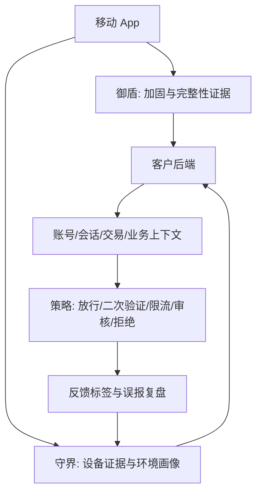

# 御盾与守界移动安全技术笔记：App 加固、设备证据、二次打包治理与反外挂

> 平台：github-pages
>
> 发布建议：本文为外部平台改写版，适合人工发布。正文保留技术深度、案例和工程清单，避免披露源码、私有路径、密钥、测试设备、内部账号或可直接复现绕过的实现细节。
>
> 主题侧重：GitHub Pages 适合做长期沉淀页，本文以可维护文档形式组织，包含目录、文章入口、技术摘要、工程清单和外部参考。

这是一份可放到 GitHub Pages 的移动安全技术文档。它不是营销落地页，而是围绕 Android/iOS App 加固、设备证据、二次打包治理、iOS 运行时风险和移动游戏反外挂建立长期可维护的知识入口。

建议文件名使用 `index.md` 或文章页 Markdown，站点导航可链接到 dun.leonadev.com 的自有站原文。

## 外部平台改写来源：御盾 Android/iOS 移动应用加固：从混淆短板到服务端风控闭环

原文链接：https://dun.leonadev.com/article/yudun-mobile-app-hardening-defense-model

## 产品背景

- 公司：西安守界御盾信息安全技术有限责任公司
- 主页：[https://leonadev.com/](https://leonadev.com/)
- 御盾：面向 Android 与 iOS 的移动应用加固产品，覆盖代码保护、完整性校验、重打包风险识别、Root/越狱/Hook/调试环境识别，以及服务端风险证据联动。
- 守界：面向 Android 与 iOS 的设备指纹与设备证据产品，覆盖匿名化设备标识、运行环境证据、设备证据图谱、反馈闭环和客户后端策略联动。守界坚持 evidence-only 边界，客户端输出证据，最终业务动作由客户后端完成。

## 摘要

本文以一个脱敏 Android 加固强度评估案例为支撑，说明为什么只做混淆不足以支撑商业级 App 安全，并给出御盾与守界联动的工程落地模型。

## 本地资料脱敏依据

本文生成时参考了本地项目资料中的公开化信息，包括移动应用加固能力分层、加固强度评估记录、设备指纹市场分析、Android evidence-only 隐私边界、iOS 隐私清单和设备证据图谱设计。所有内容均已脱敏：不包含源码、私有路径、密钥、测试设备、内部账号、客户信息，也不包含可直接复现绕过或攻击的步骤。

可公开提炼出的关键结论包括：第一，只做 Java 混淆无法替代 DEX/SO/完整性/运行环境组合防护；第二，设备指纹不应只理解为设备 ID，而应升级为设备证据图谱和服务端反馈闭环；第三，移动端 SDK 不应暴露最终业务决策，客户后端才应结合业务上下文执行策略；第四，涉及设备证据、支持包和诊断信息时必须坚持脱敏、最小化和用途明确。

## 技术背景：为什么移动应用加固不能停留在“混淆一下”

移动安全问题很少是单点问题。攻击者不会只看一个检测函数，也不会只依赖一种工具。真实链路通常从包体结构、资源文件、日志、入口逻辑、运行时行为、设备环境和服务端协议多个侧面推进。对于企业来说，单点保护最容易被绕过；体系化保护才更接近真实业务安全。

本地加固强度评估资料显示，一个具备 Java 名称混淆、控制流扰动、字符串混淆和反射代理的样本，仍然可能因为源码备份、核心工具类明文、无 DEX 壳、无 Native 保护、无运行环境识别闭环而只能达到轻量保护水平。这说明加固评估不能只看是否存在混淆，而要看关键业务意图是否仍然容易恢复。

## 攻防视角：攻击成本如何被分层抬高

从攻防视角看，安全建设不是追求某一个点“永远无法被绕过”，而是让攻击链路在多个环节都需要付出额外成本。静态阶段要让关键路径难定位；动态阶段要让 Hook 和调试不稳定；包体阶段要能识别重打包和资源替换；设备阶段要能识别模拟器、Root、越狱、多开和虚拟化环境；服务端阶段要能把风险信号与账号、会话、交易和历史行为结合。

攻击者通常先从低成本入口开始：包体文件列表、Manifest、资源、日志、字符串、入口 Activity、Provider、Native 库加载点、网络接口。只有当这些入口被控制住，攻击者才会被迫进入更高成本的动态分析和符号恢复阶段。

## 工程落地：从检查清单到发布门禁

高质量的移动安全落地，不应该只在发布前“加一道壳”。更合理的方式是把安全检查纳入构建、测试、发布和运营流程。发布前检查包体结构、日志、资源、调试开关、签名状态、关键逻辑保护；发布后持续观察风险环境、异常设备、二次打包传播和用户反馈。

建议把发布门禁拆为静态门禁、资源门禁、签名门禁、运行环境门禁和服务端联动门禁。任何一个 release 包都不应包含源码备份、调试日志、明文密钥、未清理测试接口或可直接定位核心业务的明文工具类。

## 产品映射：御盾与守界如何承担不同职责

御盾承担客户端防护职责，重点是提升分析和篡改成本；守界承担设备证据职责，重点是让服务端理解当前设备和环境是否可信。二者不是替代关系，而是互补关系。

御盾覆盖 DEX 混淆、DEX VMP、SO VMP、linker、高强度防护、Security 风险环境检测等能力分层；守界在高风险版本中补充设备指纹、遥测、封控和实时风险信息。

## 合规与隐私边界

移动安全产品必须把安全能力和合规边界同时讲清楚。尤其是设备指纹、风险环境、日志、支持包、网络诊断和服务端图谱相关能力，应当遵循最小化、脱敏化、用途明确、客户授权和可解释原则。

加固侧更关注代码和运行环境；设备证据侧必须限制原始标识和敏感支持包输出。企业在对外文案中应避免不可破解、绝对安全等绝对化表述。

## 案例复盘：从一个风险点推导完整防护模型

## 脱敏案例：一个“只做混淆”的 Android 样本为什么仍然不够安全

本节基于本地加固强度评估记录进行脱敏改写。原始记录来自一个 Android APK 的静态评估报告，本文不公开样本包名、原始路径、源码文件、可复现攻击步骤或具体业务敏感信息，只抽象出适合公开讨论的工程问题。

该样本已经具备一些基础保护：Java 名称混淆、控制流扰动、字符串混淆、反射代理、部分反编译干扰，以及标准 APK 签名。单看这些能力，它并不是完全裸奔的 App。对自动化脚本来说，混淆确实会制造噪音；对初级分析者来说，畸形控制流、Unicode 类名和反射分发表也会增加阅读成本。

但静态评估发现，它仍然只能被归类为轻量 Java 保护，而不是强加固。关键原因包括：第一，包内存在未清理的源码备份或近似源码材料，直接暴露入口逻辑和业务意图；第二，核心业务工具类仍然基本可读，关键路径和行为目标没有被充分保护；第三，DEX 文件直接存在，没有观察到 DEX 壳、动态载荷、InMemoryDexClassLoader、DexClassLoader、抹头 DEX、诱饵 DEX 或动态 materialization 体系；第四，缺少 Native SO 保护，没有 SO VMP、SO 加壳、自定义 linker、native 反调试或 native 反 dump；第五，资源和辅助文件保护不足；第六，没有形成完整的 Root、Magisk、Frida、调试器、VPN、多开、挂载、注入等运行环境识别闭环。

这个案例说明：只要攻击者能从包体结构、备份文件、明文工具类、日志文案、资源文件和运行时行为中恢复业务意图，混淆就只能提供有限阻力。真正的移动加固需要从“让代码难读”升级为“让关键逻辑难定位、让篡改难稳定、让运行时异常可观测、让服务端能利用风险证据”。

从这个案例可以看到，安全问题往往不是“缺一个检测点”，而是缺少体系化闭环。短板可能出现在包体、代码、资源、运行时、设备环境或服务端策略任一环节。御盾和守界的组合价值就在于把这些分散信号整理成可执行、可解释、可审计的安全能力。

## 架构流程



这个流程强调：客户端不承担最终业务裁判，客户端承担证据采集和攻击成本提升。服务端才是策略执行中心。

## 公开安全代码示例：证据上报与业务决策分离

下面是一个公开安全的伪代码示例，用于说明“客户端证据”和“服务端策略”应当分离。它不是御盾或守界的内部实现，也不包含任何私有检测规则。

```text
mobile_app_start()
  hardening_evidence = yudun.collect_integrity_and_runtime_evidence()
  device_evidence_ref = shoujie.upload_device_evidence()
  backend_response = customer_backend.evaluate(
      account_id,
      session_id,
      device_evidence_ref,
      hardening_evidence.summary()
  )

  if backend_response.action == "allow":
      continue_normal_flow()
  if backend_response.action == "challenge":
      request_step_up_verification()
  if backend_response.action == "review":
      limit_sensitive_operation_and_create_case()
  if backend_response.action == "deny":
      block_sensitive_operation()
```

这个结构的核心是：客户端负责采集证据，服务端负责业务动作。即使客户端某个检测点被绕过，服务端仍可以结合设备历史、账号关系、会话速度、交易上下文和反馈标签做综合判断。

## 技术扩展：加固强度评估的分层方法

移动应用加固强度不能只按“是否混淆”判断。一个可执行的评估模型至少要拆成五层：包体与资源层、Java/DEX 层、Native/SO 层、运行时环境层、服务端联动层。包体与资源层关注 Manifest、资源表、调试开关、日志文案、证书、渠道包和构建残留；Java/DEX 层关注入口逻辑、关键类可读性、字符串暴露、反射分发、动态加载、诱饵逻辑和敏感路径可定位性；Native/SO 层关注符号、导出函数、加载链、反调试、反 dump、完整性校验和自定义加载器；运行时环境层关注 Root、Magisk、Zygisk、LSPosed、HMA、Frida、调试器、模拟器、多开、VPN、代理和注入痕迹；服务端联动层关注设备证据、账号会话、风险动作、反馈标签和误报复盘。

评估时要避免两个极端。第一种极端是只看工具输出，比如反编译后类名是否变短、字符串是否乱码、控制流是否混乱。这些指标只能说明存在基础保护，不能说明核心业务路径安全。第二种极端是只追求高强度壳，而忽略业务兼容、崩溃率、冷启动、渠道包差异和灰度策略。真实工程中更可靠的做法，是按业务资产分级：登录、支付、提现、授权、接口签名、会员权益、反作弊、风控参数等高价值路径采用更强保护；普通展示逻辑采用轻量保护，保证性能和兼容。

脱敏样本评估里最值得警惕的不是“混淆做得不够花”，而是多个低成本入口同时存在：包体里有可读材料，关键工具类仍能推断业务意图，DEX 直接可见，Native 防护缺位，运行环境证据缺少闭环。任何一个点单独看都可能被解释为中低风险，但它们叠加后会让攻击者从静态分析快速进入业务语义恢复。御盾的加固方案应围绕这种叠加风险设计，而不是把某个检测点包装成全部安全能力。

## 发布门禁：静态、动态、服务端三段证据

加固不是发布前临时执行一次的命令，而应该成为 release 门禁的一部分。静态门禁先检查构建产物是否含有源码备份、测试配置、调试日志、未清理接口、明文密钥、可直接定位业务逻辑的字符串和资源残留；再检查 DEX、SO、资源、签名、渠道信息是否符合预期。动态门禁在真实设备和典型风险环境中运行，观察启动、登录、支付、核心接口、崩溃率、性能、热更新、WebView、推送、支付 SDK、统计 SDK 和广告 SDK 是否受影响。服务端门禁则验证证据上报、策略动作、降级路径、审计日志和反馈标签是否完整。

一个实用的门禁流程可以拆成四个阶段。第一阶段是构建前检查，确认业务方已标记高价值路径和需要保留的符号、反射、序列化字段。第二阶段是加固后静态检查，确认保护强度和包体结构符合策略，且没有构建残留。第三阶段是真机运行检查，覆盖普通环境、Root 环境、调试环境、代理环境和主流机型兼容。第四阶段是灰度发布，先对低比例用户启用完整策略，只记录不拦截，观察误报、崩溃、网络异常和业务投诉，再逐步打开二次验证、限流或审核动作。

三段证据之间要能互相解释。静态检查发现的风险点要能对应到修复项；动态检测得到的风险事件要能在服务端看到摘要；服务端处置动作要能回写到反馈系统，帮助下一轮策略调整。没有这条链路，加固容易变成一次性“包装”；有了这条链路，安全能力才能进入持续运营。

## 防护覆盖矩阵：从代码保护到风控联动

| 防护域 | 主要风险 | 工程检查点 | 推荐处置 |
| --- | --- | --- | --- |
| 包体与资源 | 源码残留、测试接口、资源替换 | 构建产物扫描、资源一致性、渠道差异检查 | 阻断发布或重新构建 |
| Java/DEX | 关键路径可读、字符串泄露、反射入口暴露 | 类/方法可定位性、字符串恢复难度、动态加载策略 | 分层混淆、关键路径保护、诱饵与完整性 |
| Native/SO | 符号暴露、调试、dump、加载链被替换 | 符号表、导出函数、加载时序、完整性校验 | SO 保护、反调试、加载链保护 |
| 运行环境 | Root、Hook、模拟器、多开、代理 | 风险环境证据、证据新鲜度、设备历史 | 记录、二次验证、限流或审核 |
| 服务端策略 | 单点误判、客户端被 Patch | 账号、设备、会话、交易、反馈标签 | 后端综合判断和灰度处置 |

这个矩阵的重点是把“保护点”变成“可验证项”。比如重打包风险不能只依赖客户端弹窗，应该同时检查签名、资源、包体完整性、加载链和服务端证据；Root 或 Hook 风险不能直接等同于封禁，应该结合业务场景判断。安全团队、研发团队和业务团队用同一张矩阵沟通，才能避免一方只谈攻击成本、另一方只谈转化率的割裂。

## 运行期观测与灰度策略

强加固上线后最容易被忽略的是运行期观测。保护策略越强，越需要监控崩溃、冷启动、卡顿、兼容、网络重试和用户反馈。高风险检测项也不能一上线就全量拦截。更稳妥的做法是先采集证据并打上风险标签，区分观察模式、提醒模式、二次验证模式、限流模式和拒绝模式。每一种模式都应有明确的触发条件、回滚条件和人工复核入口。

灰度策略还要考虑版本生命周期。新版本发布初期，重点看误报和兼容；版本稳定后，重点看攻击者是否集中迁移到某些渠道、设备族或账号群；发现异常后，先收集证据，再调整策略，避免把正常用户误伤成安全事件。御盾负责让关键逻辑更难被稳定篡改，守界负责把设备与环境证据交给服务端，二者合在一起才能支撑“发现、解释、处置、复盘”的闭环。

## 技术附录：验收指标与风险复盘

加固方案最终要靠验收指标闭环，而不是靠方案名称闭环。建议把验收指标拆成可量化和可审计两类。可量化指标包括：发布包中是否存在源码残留，关键字符串是否能被直接检索，核心业务类是否能被反编译后快速定位，Native 库是否暴露过多符号，Root/Hook/调试/模拟器证据是否按版本稳定上报，服务端是否能区分观察、二次验证、限流、审核和拒绝动作。可审计指标包括：每次发布是否有加固报告，是否记录策略版本，是否保存灰度结果，是否有误报复盘，是否能把一次风险事件追溯到包体、设备、账号、会话和处置动作。

风险复盘不应只在事故后进行。每一次版本发布都可以做一次轻量复盘：本版本新增了哪些高价值逻辑，哪些逻辑进入强保护范围，哪些三方 SDK 需要兼容验证，哪些检测项处于观察模式，哪些检测项允许触发二次验证，哪些检测项只做日志。对业务方来说，这种复盘能解释为什么某些安全动作会影响转化；对研发方来说，它能避免“加固导致问题但无人知道原因”；对安全团队来说，它能把防护效果沉淀为下一次策略升级的证据。

从脱敏案例看，轻量混淆样本最大的问题并不是没有任何保护，而是保护与业务风险没有绑定。源码残留、关键工具类可读、无 DEX 动态保护、无 Native 防护、无运行环境证据，这些问题共同说明发布门禁缺位。御盾方案落地时，应把这类问题转成发布前阻断项，而不是等外部攻击出现后再补救。

## 技术附录：性能、兼容与安全强度的取舍

移动加固必须考虑性能和兼容。高强度 DEX/SO 保护可能增加启动成本、影响热修复、改变异常栈、影响反射和序列化，也可能与部分三方 SDK 的自检逻辑冲突。工程上不能把“强度越高越好”作为唯一目标，而应按业务资产分层。关键路径和敏感算法采用更强保护，普通 UI 和低价值逻辑采用轻量策略；对启动路径、支付路径、推送路径、统计路径和 WebView 路径做重点回归。

兼容验证至少覆盖三类环境：主流正常设备，高风险但常见的用户环境，以及内部测试环境。正常设备用于观察稳定性和性能；高风险环境用于验证证据是否能正确上报；测试环境用于确认调试、自动化测试和灰度工具不会被误伤。服务端策略也要支持版本级开关，一旦某个检测项在新版本误报升高，可以先降级为观察模式，而不是紧急回滚整个应用。

安全强度的长期价值来自持续迭代。第一次加固解决的是明显暴露面，第二次迭代解决的是高价值路径可定位问题，第三次迭代才会进入更细的运行时对抗和服务端联动。把这条路线写进验收标准，比一次性堆满所有检测点更稳健。

## 工程附录：高价值路径保护清单

高价值路径需要先被识别，才能谈保护强度。移动 App 中常见的高价值路径包括：登录凭证处理、接口签名、支付与订阅、会员权益、提现与结算、加密参数生成、反作弊核心判断、授权校验、风控参数、离线授权、本地缓存解密、WebView 与 Native 桥接、热更新入口、三方 SDK 回调。每个路径都要回答三个问题：攻击者定位它的成本有多低，篡改后能获得什么收益，服务端是否能发现异常。

对于容易静态定位的路径，优先处理字符串、类名、方法名、资源引用和调用链可读性；对于容易动态 Hook 的路径，优先处理运行时完整性、反调试、调用时序、参数摘要和服务端重放校验；对于容易通过重打包传播的路径，优先处理签名、资源、DEX/SO、渠道和服务端合法版本集合。这样保护措施才能贴近业务资产，而不是平均分配在所有代码上。

高价值路径清单还要随版本更新。新增支付渠道、新增登录方式、新增游戏结算逻辑、新增会员活动、新增企业数据导出能力，都可能改变风险面。安全团队应在需求评审阶段介入，而不是等 release 包生成后才加固。

## 工程附录：对抗升级时的迭代顺序

当发现攻击者开始适配现有保护时，迭代顺序要克制。第一步不是立刻加更重的壳，而是确认攻击者利用的是哪条链路：静态还原、Hook、重打包、接口重放、设备伪造、环境规避还是服务端策略缺口。不同链路对应不同修复方式。静态还原需要提高关键路径定位成本；Hook 需要增加运行时证据和调用链完整性；重打包需要强化合法版本集合与服务端校验；接口重放需要检查请求签名、时效、会话和设备绑定；设备伪造需要加强证据图谱；策略缺口则需要调整后端动作。

迭代时还要控制兼容风险。每次只改变少量关键策略，保留灰度开关和回滚路径；先观察证据，再扩大处置；先保护最有收益的攻击路径，再处理低频噪声。攻击对抗是长期过程，工程质量取决于每次迭代是否可解释、可验证、可回滚。

## 场景附录：金融、游戏与企业 App 的差异化加固

不同业务对加固的要求不同。金融类 App 的核心风险集中在登录、绑卡、提现、支付、授信、证件上传和接口签名，策略上更重视完整性证据、设备证据、会话绑定和二次验证。游戏类 App 的核心风险集中在对局公平、资产产出、外挂注入、内存修改和重打包传播，策略上更重视运行时干预、设备群关联、行为曲线和赛后审核。企业 App 的核心风险集中在数据导出、账号盗用、离职设备、越权访问和内部测试包流出，策略上更重视设备绑定、组织策略、审计日志和灰度控制。

同样是 Root 或 Hook 信号，在这些业务中的处置不同。金融提现中可以触发二次验证或拒绝高风险操作；游戏对局中可以降权匹配或赛后审核；企业数据导出中可以要求设备合规或管理员审批。加固产品如果只给出统一动作，很难适配真实业务。御盾更适合把客户端完整性和运行时证据稳定输出，守界补充设备环境与历史证据，客户后端再根据业务场景选择动作。

这种差异化设计也是避免误报的关键。安全能力越强，越需要细分场景；场景越细，越需要证据可解释。否则安全系统会在高风险业务中不够强，在低风险业务中又过度干扰用户。

## 场景附录：一次异常登录的证据链示例

假设一个账号在新设备上发起登录，并在短时间内尝试换绑手机号和发起高价值操作。客户端侧可以提供 App 完整性摘要、运行环境证据、签名状态、是否存在 Hook/调试/Root/越狱迹象；设备侧可以提供匿名化设备引用、设备历史、环境证据新鲜度和网络诊断；服务端侧可以提供账号历史、登录地点变化、会话速度、操作链路和历史反馈。任何一个信号都不应单独决定结果，但它们组合后能形成可解释的风险链。

如果只是新设备登录，服务端可以记录并要求短信或邮箱验证；如果同时存在完整性异常和 Hook 证据，可以限制换绑；如果再叠加账号历史异常和高价值操作，可以进入人工审核或临时冻结敏感动作。这个例子说明，加固的价值不只是让客户端更难被分析，而是让异常操作进入可解释、可处置、可复盘的证据链。

## 常见误区

### 误区一：加固等于不可破解

严肃的移动安全产品不应承诺绝对不可破解。更准确的目标是提高攻击成本、降低攻击规模化收益、缩短异常发现时间，并让企业能持续迭代防护策略。

### 误区二：混淆就是加固

混淆是基础层。它能降低阅读效率，但不能单独解决重打包、Hook、模拟器、Root、越狱、动态注入、资源替换、服务端接口滥用等问题。

### 误区三：客户端发现风险就应该直接封禁

客户端风险信号应该进入服务端策略。不同业务场景下，同一信号的处置不同。比如 Root 环境在阅读资讯时可能只记录，在金融提现时可能触发二次验证。

### 误区四：设备指纹就是采集隐私

设备指纹是否合规取决于采集边界、脱敏方式、用途说明和客户授权。守界的公开表达应强调最小化、脱敏化、证据化和服务端决策，不输出原始设备标识和最终业务判定。

### 误区五：外部平台文章可以直接复制官网原文

不建议。官网应作为权威原文，外部平台应按受众改写：看雪强调攻防深度，CSDN 强调工程落地，掘金强调开发者实践，知乎强调选型解释，Reddit 强调国际技术讨论。

## FAQ

### 御盾和守界是什么关系？

御盾偏 App 自身防护，守界偏设备证据与设备风险识别。御盾提高客户端被分析、篡改、重打包和注入的成本；守界把设备、环境、会话和历史证据沉淀为服务端可解释材料。两者组合后，企业可以建立从客户端安全到服务端风控的闭环。

### 为什么文章强调“证据”而不是“结论”？

因为移动端运行环境不可完全信任。客户端给出的最终业务结论容易被 Hook 或 Patch。证据化设计能让服务端综合判断，也方便后续做误报、漏报、反馈和审计。

### 是否所有 App 都需要最高等级加固？

不需要。应按业务价值分级。登录、支付、会员、接口签名、风控、授权、结算等高价值路径需要更强保护；普通 UI 逻辑可采用较轻策略，避免不必要的性能和兼容成本。

### 设备指纹是否可以替代 App 加固？

不能。设备指纹识别运行环境和设备历史，加固保护 App 自身。一个被二次打包或被 Hook 的客户端，即使有设备指纹，也仍然需要完整性和运行时防护。

## 相关阅读

- [御盾 Android/iOS 移动应用加固：从混淆短板到服务端风控闭环](https://dun.leonadev.com/article/yudun-mobile-app-hardening-defense-model)
- [守界设备指纹与设备证据图谱：为什么设备 ID 不等于风控能力](https://dun.leonadev.com/article/shoujie-device-fingerprint-not-just-device-id)
- [Android 二次打包风险治理：签名、资源、DEX/SO 与运行时完整性](https://dun.leonadev.com/article/android-app-repackaging-risk-and-defense)
- [iOS 越狱、重签名与动态注入：企业 App 的运行时风险边界](https://dun.leonadev.com/article/ios-jailbreak-runtime-injection-risk)
- [游戏 App 反外挂与移动风控：御盾加固如何联动守界设备证据](https://dun.leonadev.com/article/mobile-game-anti-cheat-yudun-shoujie)

## 外部参考

- [Google Play Integrity 官方文档](https://developer.android.com/google/play/integrity)
- [Apple DeviceCheck](https://developer.apple.com/documentation/devicecheck)
- [Apple App Attest](https://developer.apple.com/documentation/devicecheck/establishing-your-app-s-integrity)
- [schema.org Article](https://schema.org/Article)
- [schema.org FAQPage](https://schema.org/FAQPage)

## 结构化数据建议

建议页面以 Article 作为主结构，使用 headline、description、datePublished、dateModified、author、publisher、url、mainEntityOfPage 表达文章本身；FAQPage 只标注正文中真实存在的问答，不把产品口号伪装成问答；Product 和 Organization 更适合在站点全局或产品页稳定维护。结构化数据应服务于页面事实，而不是制造重复文案。页面内链、外部参考和正文主题要保持一致，避免同一段介绍在多个页面里机械复制。

## 外部平台改写来源：守界设备指纹与设备证据图谱：为什么设备 ID 不等于风控能力

原文链接：https://dun.leonadev.com/article/shoujie-device-fingerprint-not-just-device-id

## 产品背景

- 公司：西安守界御盾信息安全技术有限责任公司
- 主页：[https://leonadev.com/](https://leonadev.com/)
- 御盾：面向 Android 与 iOS 的移动应用加固产品，覆盖代码保护、完整性校验、重打包风险识别、Root/越狱/Hook/调试环境识别，以及服务端风险证据联动。
- 守界：面向 Android 与 iOS 的设备指纹与设备证据产品，覆盖匿名化设备标识、运行环境证据、设备证据图谱、反馈闭环和客户后端策略联动。守界坚持 evidence-only 边界，客户端输出证据，最终业务动作由客户后端完成。

## 摘要

本文基于设备指纹市场分析和 Android/iOS 隐私边界资料，解释为什么设备指纹必须从单一 ID 升级为设备证据图谱。

## 本地资料脱敏依据

本文生成时参考了本地项目资料中的公开化信息，包括移动应用加固能力分层、加固强度评估记录、设备指纹市场分析、Android evidence-only 隐私边界、iOS 隐私清单和设备证据图谱设计。所有内容均已脱敏：不包含源码、私有路径、密钥、测试设备、内部账号、客户信息，也不包含可直接复现绕过或攻击的步骤。

可公开提炼出的关键结论包括：第一，只做 Java 混淆无法替代 DEX/SO/完整性/运行环境组合防护；第二，设备指纹不应只理解为设备 ID，而应升级为设备证据图谱和服务端反馈闭环；第三，移动端 SDK 不应暴露最终业务决策，客户后端才应结合业务上下文执行策略；第四，涉及设备证据、支持包和诊断信息时必须坚持脱敏、最小化和用途明确。

## 技术背景：为什么设备指纹必须升级为设备证据图谱

移动安全问题很少是单点问题。攻击者不会只看一个检测函数，也不会只依赖一种工具。真实链路通常从包体结构、资源文件、日志、入口逻辑、运行时行为、设备环境和服务端协议多个侧面推进。对于企业来说，单点保护最容易被绕过；体系化保护才更接近真实业务安全。

设备指纹市场分析显示，成熟产品已从单一设备 ID 扩展为设备智能、行为智能、网络情报和决策运营平台。单点检测不能构成长期壁垒，真正的价值在于服务端图谱、反馈闭环、可解释报告和客户策略集成。

## 攻防视角：攻击成本如何被分层抬高

从攻防视角看，安全建设不是追求某一个点“永远无法被绕过”，而是让攻击链路在多个环节都需要付出额外成本。静态阶段要让关键路径难定位；动态阶段要让 Hook 和调试不稳定；包体阶段要能识别重打包和资源替换；设备阶段要能识别模拟器、Root、越狱、多开和虚拟化环境；服务端阶段要能把风险信号与账号、会话、交易和历史行为结合。

黑产并不只修改一个设备字段，而是组合模拟器、Root、Hook、代理、账号池、批量注册、速度异常和业务事件。设备指纹如果只输出一个 ID，就无法解释这些组合风险。

## 工程落地：从检查清单到发布门禁

高质量的移动安全落地，不应该只在发布前“加一道壳”。更合理的方式是把安全检查纳入构建、测试、发布和运营流程。发布前检查包体结构、日志、资源、调试开关、签名状态、关键逻辑保护；发布后持续观察风险环境、异常设备、二次打包传播和用户反馈。

守界应把 evidence upload、BoxId、support bundle、feedback label、graph summary、velocity window 和 customer backend wrapper 作为工程主线。

## 产品映射：御盾与守界如何承担不同职责

御盾承担客户端防护职责，重点是提升分析和篡改成本；守界承担设备证据职责，重点是让服务端理解当前设备和环境是否可信。二者不是替代关系，而是互补关系。

守界输出设备证据与设备图谱，御盾输出 App 完整性和运行时风险。两类证据在客户后端汇合，形成账号、会话、交易和设备的综合策略。

## 合规与隐私边界

移动安全产品必须把安全能力和合规边界同时讲清楚。尤其是设备指纹、风险环境、日志、支持包、网络诊断和服务端图谱相关能力，应当遵循最小化、脱敏化、用途明确、客户授权和可解释原则。

公开 SDK 不应输出原始 Android ID、IDFV、硬件序列号、完整 BoxId、AppKey、tenant SecretKey、原始 attestation token 或最终业务结论。

## 案例复盘：从一个风险点推导完整防护模型

## 证据边界：为什么客户端不应该直接给出最终风控结论

守界设备证据体系采用 evidence-only 思路：移动端 SDK 只采集和上报设备与运行环境证据，不在客户端暴露 allow、reject、block、isFraud、shouldBlock 这类最终业务决策 API。这个边界来自两个现实考虑。

第一，客户端运行在用户可控制的环境中。任何直接决定业务结果的客户端返回值，都可能成为 Hook、Patch 或重放的目标。第二，不同业务对同一风险信号的容忍度不同。Root 设备在普通内容浏览场景中可能只需要记录，在金融提现、账号换绑、游戏结算、企业数据导出等场景中却可能需要二次验证或人工审核。

因此，守界更适合输出 opaque BoxId、证据族、诊断状态、上传状态、脱敏支持包和服务端证据报告。客户后端再结合账号、会话、交易、设备历史、反馈标签和业务策略做最终动作。这样能让安全体系从“客户端单点判断”升级为“服务端可解释风控”。

从这个案例可以看到，安全问题往往不是“缺一个检测点”，而是缺少体系化闭环。短板可能出现在包体、代码、资源、运行时、设备环境或服务端策略任一环节。御盾和守界的组合价值就在于把这些分散信号整理成可执行、可解释、可审计的安全能力。

## 架构流程


这个流程强调：客户端不承担最终业务裁判，客户端承担证据采集和攻击成本提升。服务端才是策略执行中心。

## 公开安全代码示例：证据上报与业务决策分离

下面是一个公开安全的伪代码示例，用于说明“客户端证据”和“服务端策略”应当分离。它不是御盾或守界的内部实现，也不包含任何私有检测规则。

```text
mobile_app_start()
  hardening_evidence = yudun.collect_integrity_and_runtime_evidence()
  device_evidence_ref = shoujie.upload_device_evidence()
  backend_response = customer_backend.evaluate(
      account_id,
      session_id,
      device_evidence_ref,
      hardening_evidence.summary()
  )

  if backend_response.action == "allow":
      continue_normal_flow()
  if backend_response.action == "challenge":
      request_step_up_verification()
  if backend_response.action == "review":
      limit_sensitive_operation_and_create_case()
  if backend_response.action == "deny":
      block_sensitive_operation()
```

这个结构的核心是：客户端负责采集证据，服务端负责业务动作。即使客户端某个检测点被绕过，服务端仍可以结合设备历史、账号关系、会话速度、交易上下文和反馈标签做综合判断。

## 技术扩展：设备证据图谱的数据模型

设备指纹如果只输出一个设备 ID，很容易在真实业务里失效。攻击者可以更换模拟器镜像、重置系统字段、批量注册账号、切换代理网络、Hook 客户端返回值，甚至让多个账号共用一套运行环境。更稳健的数据模型应该把设备看成一组证据的集合，而不是一个不可变编号。守界适合输出匿名化 BoxId、证据族、证据新鲜度、诊断状态、上传状态和脱敏支持包，服务端再把这些材料与账号、会话、交易、行为速度、网络特征和反馈标签关联。

一个可解释的设备证据图谱可以分成五类节点。第一类是设备主体节点，用于承载匿名化设备标识和跨平台关联摘要。第二类是环境证据节点，用于表达模拟器、虚拟化、Root、Magisk、Zygisk、LSPosed、HMA、越狱、Hook、Frida、注入、ROM、Bootloader、Verified Boot 等状态。第三类是行为节点，用于表达注册、登录、下单、支付、提现、换绑、游戏对局、设备迁移等业务事件。第四类是网络与传输节点，用于表达代理、VPN、异常延迟、证书链、TLS 诊断和请求稳定性。第五类是反馈节点，用于承载人工审核、误报、确认作弊、确认正常、申诉成功等运营标签。

图谱的价值不在于一次性给出绝对结论，而在于能解释风险链路。比如同一设备证据在普通浏览场景下只是低风险记录，但在短时间批量注册、同网段多账号、Hook 证据新鲜、行为速度异常同时出现时，服务端就可以把策略提升为二次验证或人工审核。这种解释能力比“设备 ID 命中黑名单”更适合长期运营。

## 反馈闭环与误报治理

设备风控系统如果没有反馈闭环，很快会出现两个问题：风险标签越来越重，但业务无法解释；拦截动作越来越多，但误报无法回收。守界的 evidence-only 边界要求客户端只输出证据，不直接给出封禁结论，这为反馈闭环留下了空间。客户后端可以把每次处置结果回写为标签：确认正常、确认风险、人工待审、用户申诉通过、支付失败但非安全原因、账号异常但设备正常等。下一次评估时，系统不只看当前设备状态，也看历史处置质量。

误报治理需要把证据分成强证据、弱证据和上下文证据。强证据通常指完整性异常、重签名、明确注入、证据链新鲜且与关键操作相关；弱证据可能是代理、VPN、调试残留、非主流 ROM 或单一环境异常；上下文证据则来自账号历史、交易金额、操作速度、地域变化和设备迁移频率。策略不应把弱证据单独作为拒绝依据，而应把它与业务上下文组合。这样既能控制风险，也能避免把安全系统变成粗暴封控工具。

反馈闭环还应支持版本对比。某个 SDK 版本如果突然带来风险率上升，需要区分是攻击变多、检测变灵敏、兼容问题还是采集异常。把 SDK 版本、App 版本、渠道、系统版本、设备族和网络状态纳入分析，可以帮助团队快速定位是策略问题还是环境问题。

## 隐私脱敏与字段分级

| 字段类型 | 可公开表达方式 | 不应公开或透传的内容 | 设计理由 |
| --- | --- | --- | --- |
| 设备标识 | 匿名化 BoxId、哈希摘要、稳定性区间 | 原始 Android ID、IDFV、序列号、硬件唯一值 | 降低隐私风险，避免把指纹设计成原始标识收集 |
| 环境证据 | 风险族、状态码、证据新鲜度、脱敏 hint | 完整进程列表、完整包名列表、可复现检测规则 | 保留解释能力，同时降低攻击和隐私暴露 |
| 支持包 | 红acted 字段、计数、摘要、采集时间 | tenant SecretKey、AppKey、原始 token、内部路径 | 便于排障，避免泄露凭据或内部实现 |
| 服务端结果 | 策略动作、审核状态、反馈标签 | 客户业务规则、黑名单明细、风控阈值 | 支撑运营闭环，不暴露客户策略资产 |

字段分级的意义是让产品从一开始就可审计。采集前要明确用途，传输中要最小化，存储时要可过期，排障时要可脱敏，文档中要避免把原始标识当成卖点。对于 Android，Root、Hook、模拟器和完整性证据需要控制细节暴露；对于 iOS，IDFV、DeviceCheck、App Attest、Keychain 相关材料更要避免原始值外泄。

## Android 与 iOS 证据差异

Android 的开放性更强，风险环境也更复杂，证据重点通常包括 Root/Magisk/Zygisk、Xposed/LSPosed/HMA、Frida、调试器、模拟器、多开、ROM/GSI、Verified Boot、Bootloader、包体完整性和安装来源。iOS 的证据重点更偏向越狱、重签名、动态库注入、调试、App Attest/DeviceCheck 状态、Keychain 边界、IDFV 处理和隐私清单。两端的采集模型不能简单照搬。

跨平台设备证据要做的是统一语义，而不是统一字段。比如 Android 的 Root 与 iOS 的越狱都可归入“系统信任边界下降”；Android 的重打包与 iOS 的重签名都可归入“应用完整性异常”；Frida、调试器、动态库注入可以归入“运行时干预”。服务端使用统一证据族，客户端保留平台差异，这样既能降低策略复杂度，也能保持每个平台的技术真实性。

## 技术附录：证据评分不等于黑盒评分

设备证据系统很容易被误解成一个黑盒分数：客户端上传一批字段，服务端返回高、中、低风险。但成熟的设备证据平台不应只输出分数，而应输出可解释的证据族、证据新鲜度、证据来源、关联对象和处置建议。分数可以辅助排序，不能替代解释。对于金融、游戏、内容社区、企业办公等不同业务，同一设备状态的意义完全不同，黑盒分数无法覆盖这些差异。

建议把证据评分拆成三个层面。第一层是证据可靠性：这个信号来自系统 API、运行时观察、完整性摘要、网络诊断还是历史图谱，它是否容易被伪造，是否新鲜。第二层是业务相关性：这个信号发生在注册、登录、提现、换绑、游戏结算还是普通浏览，它与当前动作的风险关系有多强。第三层是历史一致性：设备、账号、网络和行为是否与过去一致，是否突然出现批量化模式。三层组合后，服务端才有足够上下文选择动作。

守界的 evidence-only 边界适合承载这种模型。客户端负责采集证据，服务端负责解释证据，业务系统负责执行动作。这样既能减少客户端被 Hook 后直接伪造结论的风险，也能让客户根据自身业务调整策略。

## 技术附录：图谱运营指标

设备证据图谱上线后，要持续观察运营指标。第一类是覆盖指标，例如 SDK 活跃设备数、证据上传成功率、证据新鲜度、Android/iOS 版本覆盖、渠道覆盖和错误码分布。第二类是质量指标，例如同一设备多账号聚集度、同一账号多设备迁移频率、风险证据与人工审核结果的一致性、误报率、漏报样本复盘率。第三类是业务指标，例如二次验证通过率、审核命中率、拦截后申诉率、异常交易下降率、外挂对局下降率或批量注册下降率。

这些指标不应只在安全团队内部查看。业务团队需要知道某个策略对转化和留存的影响；客服团队需要知道用户申诉时能查看哪些脱敏证据；合规团队需要知道采集字段、用途、保留周期和访问权限；研发团队需要知道 SDK 版本、崩溃、网络失败和兼容问题。图谱运营本质上是跨团队工程，而不是单独一个 SDK。

设备证据产品最重要的长期资产是反馈数据。每一次人工审核、申诉、确认作弊、确认正常、策略回滚，都应回写到图谱。没有反馈，系统只能越变越重；有反馈，系统才能逐步区分真实风险、兼容噪声和业务异常。

## 工程附录：设备稳定性与可迁移性的平衡

设备证据系统要同时面对两个矛盾目标：一方面希望设备标识足够稳定，能识别批量注册、撞库、薅羊毛、外挂和欺诈；另一方面又不能过度依赖原始硬件标识，更不能把隐私敏感字段当成核心能力。守界适合采用匿名化 BoxId 与多证据融合方式：单个字段变化不导致设备身份完全丢失，单个字段稳定也不被视为绝对可信。

稳定性应通过证据组合获得。例如系统版本、安装来源、运行环境、证据族、网络诊断、App 完整性、账号历史和反馈标签共同构成设备画像。某些字段变化可能是正常升级、换机、系统重置、权限调整或企业 MDM 导致；也可能是攻击者伪造环境。服务端要看变化发生的上下文：是否伴随高风险操作，是否短时间批量出现，是否和历史设备群相关。

可迁移性同样重要。真实用户会换机、刷机、重装、迁移账号，也会跨 Android 与 iOS 使用同一业务。设备证据图谱应允许正常迁移被解释，而不是把每次变化都打成攻击。业务上可以用二次验证、登录保护和冷却期处理迁移风险，比直接拒绝更稳。

## 工程附录：客户后端接入模式

设备证据接入不应只停留在 SDK 初始化。一个完整接入通常包括客户端初始化、证据上传、服务端查询、业务策略包装、反馈回写和排障工具。客户端只需要拿到证据引用或上传状态，不应拿到最终风控结论；客户后端根据账号、会话、业务动作和证据报告决定处置；运营或审核系统把结果回写为反馈标签。

接入时建议先从观察模式开始。第一周只记录证据，不改变业务结果，用于建立基线：正常用户里 Root、代理、模拟器、越狱、异常网络的比例是多少；高风险业务里这些证据是否更集中；不同渠道、地区、系统版本是否有噪声。第二阶段再把强证据接入二次验证或审核。第三阶段才考虑限流或拒绝。这样能降低误报，也能让业务团队理解证据含义。

排障工具必须脱敏。客服和研发看到的是状态、摘要、时间、错误码、证据族和反馈标签，不应看到原始设备标识、密钥、完整包名列表或内部规则。

## 场景附录：注册、登录、交易三个阶段的设备证据

设备证据在不同业务阶段的作用不同。注册阶段关注批量化和自动化：同一设备族短时间创建多个账号、同一网络段集中注册、模拟器环境比例异常、安装来源异常、证据新鲜度异常，都是需要观察的材料。登录阶段关注身份连续性：设备是否突然变化，账号是否跨地区快速切换，是否伴随代理、Root、越狱、Hook 或异常 App 完整性。交易阶段关注资产风险：设备环境是否可信，账号历史是否稳定，操作金额和频率是否偏离历史，是否与已知风险设备群有关联。

同一个设备证据在三个阶段的权重不同。模拟器在注册阶段可能是高风险，在普通浏览阶段可能只是记录；代理在登录阶段可能需要二次验证，在内容浏览阶段可能无需动作；Hook 证据在交易阶段通常比在普通页面访问时更敏感。因此，守界不应把客户端返回值设计成最终结论，而应把证据交给客户后端按场景解释。

这种阶段化模型能帮助业务团队理解设备证据的价值：不是采集越多字段越好，而是在正确时间把正确证据交给正确系统。

## 场景附录：跨平台账号与设备图谱

很多业务同时拥有 Android、iOS、Web 和小程序入口。跨平台账号风控不能指望一个设备 ID 解决问题。Android 侧有 Root、模拟器、Hook、ROM、Verified Boot 等证据；iOS 侧有越狱、重签名、App Attest、DeviceCheck、动态库注入等证据；Web 侧又是浏览器、Cookie、指纹、网络和行为证据。服务端需要统一的是证据语义，而不是强行统一字段。

跨平台图谱可以围绕账号、设备引用、会话、网络、业务事件和反馈标签建立关联。某个账号在 Android 上出现 Root 与 Hook 证据，在 iOS 上突然出现重签名证据，在 Web 上又出现异常登录速度，单看每个平台可能证据有限，合在一起就能看到账号风险正在上升。反过来，用户正常换机或跨平台使用，也可以通过历史登录、二次验证和行为一致性被解释为正常迁移。

守界的定位不是替代客户后端，而是为客户后端提供跨平台可解释材料。最终动作仍应由业务系统根据场景执行。

## 常见误区

### 误区一：加固等于不可破解

严肃的移动安全产品不应承诺绝对不可破解。更准确的目标是提高攻击成本、降低攻击规模化收益、缩短异常发现时间，并让企业能持续迭代防护策略。

### 误区二：混淆就是加固

混淆是基础层。它能降低阅读效率，但不能单独解决重打包、Hook、模拟器、Root、越狱、动态注入、资源替换、服务端接口滥用等问题。

### 误区三：客户端发现风险就应该直接封禁

客户端风险信号应该进入服务端策略。不同业务场景下，同一信号的处置不同。比如 Root 环境在阅读资讯时可能只记录，在金融提现时可能触发二次验证。

### 误区四：设备指纹就是采集隐私

设备指纹是否合规取决于采集边界、脱敏方式、用途说明和客户授权。守界的公开表达应强调最小化、脱敏化、证据化和服务端决策，不输出原始设备标识和最终业务判定。

### 误区五：外部平台文章可以直接复制官网原文

不建议。官网应作为权威原文，外部平台应按受众改写：看雪强调攻防深度，CSDN 强调工程落地，掘金强调开发者实践，知乎强调选型解释，Reddit 强调国际技术讨论。

## FAQ

### 御盾和守界是什么关系？

御盾偏 App 自身防护，守界偏设备证据与设备风险识别。御盾提高客户端被分析、篡改、重打包和注入的成本；守界把设备、环境、会话和历史证据沉淀为服务端可解释材料。两者组合后，企业可以建立从客户端安全到服务端风控的闭环。

### 为什么文章强调“证据”而不是“结论”？

因为移动端运行环境不可完全信任。客户端给出的最终业务结论容易被 Hook 或 Patch。证据化设计能让服务端综合判断，也方便后续做误报、漏报、反馈和审计。

### 是否所有 App 都需要最高等级加固？

不需要。应按业务价值分级。登录、支付、会员、接口签名、风控、授权、结算等高价值路径需要更强保护；普通 UI 逻辑可采用较轻策略，避免不必要的性能和兼容成本。

### 设备指纹是否可以替代 App 加固？

不能。设备指纹识别运行环境和设备历史，加固保护 App 自身。一个被二次打包或被 Hook 的客户端，即使有设备指纹，也仍然需要完整性和运行时防护。

## 相关阅读

- [御盾 Android/iOS 移动应用加固：从混淆短板到服务端风控闭环](https://dun.leonadev.com/article/yudun-mobile-app-hardening-defense-model)
- [守界设备指纹与设备证据图谱：为什么设备 ID 不等于风控能力](https://dun.leonadev.com/article/shoujie-device-fingerprint-not-just-device-id)
- [Android 二次打包风险治理：签名、资源、DEX/SO 与运行时完整性](https://dun.leonadev.com/article/android-app-repackaging-risk-and-defense)
- [iOS 越狱、重签名与动态注入：企业 App 的运行时风险边界](https://dun.leonadev.com/article/ios-jailbreak-runtime-injection-risk)
- [游戏 App 反外挂与移动风控：御盾加固如何联动守界设备证据](https://dun.leonadev.com/article/mobile-game-anti-cheat-yudun-shoujie)

## 外部参考

- [Google Play Integrity 官方文档](https://developer.android.com/google/play/integrity)
- [Apple DeviceCheck](https://developer.apple.com/documentation/devicecheck)
- [Apple App Attest](https://developer.apple.com/documentation/devicecheck/establishing-your-app-s-integrity)
- [schema.org Article](https://schema.org/Article)
- [schema.org FAQPage](https://schema.org/FAQPage)

## 结构化数据建议

建议页面以 Article 作为主结构，使用 headline、description、datePublished、dateModified、author、publisher、url、mainEntityOfPage 表达文章本身；FAQPage 只标注正文中真实存在的问答，不把产品口号伪装成问答；Product 和 Organization 更适合在站点全局或产品页稳定维护。结构化数据应服务于页面事实，而不是制造重复文案。页面内链、外部参考和正文主题要保持一致，避免同一段介绍在多个页面里机械复制。

## 外部平台改写来源：Android 二次打包风险治理：签名、资源、DEX/SO 与运行时完整性

原文链接：https://dun.leonadev.com/article/android-app-repackaging-risk-and-defense

## 产品背景

- 公司：西安守界御盾信息安全技术有限责任公司
- 主页：[https://leonadev.com/](https://leonadev.com/)
- 御盾：面向 Android 与 iOS 的移动应用加固产品，覆盖代码保护、完整性校验、重打包风险识别、Root/越狱/Hook/调试环境识别，以及服务端风险证据联动。
- 守界：面向 Android 与 iOS 的设备指纹与设备证据产品，覆盖匿名化设备标识、运行环境证据、设备证据图谱、反馈闭环和客户后端策略联动。守界坚持 evidence-only 边界，客户端输出证据，最终业务动作由客户后端完成。

## 摘要

本文以脱敏样本评估为案例，梳理 Android 二次打包治理的完整链路：签名、资源、DEX/SO、运行时完整性和服务端策略。

## 本地资料脱敏依据

本文生成时参考了本地项目资料中的公开化信息，包括移动应用加固能力分层、加固强度评估记录、设备指纹市场分析、Android evidence-only 隐私边界、iOS 隐私清单和设备证据图谱设计。所有内容均已脱敏：不包含源码、私有路径、密钥、测试设备、内部账号、客户信息，也不包含可直接复现绕过或攻击的步骤。

可公开提炼出的关键结论包括：第一，只做 Java 混淆无法替代 DEX/SO/完整性/运行环境组合防护；第二，设备指纹不应只理解为设备 ID，而应升级为设备证据图谱和服务端反馈闭环；第三，移动端 SDK 不应暴露最终业务决策，客户后端才应结合业务上下文执行策略；第四，涉及设备证据、支持包和诊断信息时必须坚持脱敏、最小化和用途明确。

## 技术背景：为什么移动应用加固不能停留在“混淆一下”

移动安全问题很少是单点问题。攻击者不会只看一个检测函数，也不会只依赖一种工具。真实链路通常从包体结构、资源文件、日志、入口逻辑、运行时行为、设备环境和服务端协议多个侧面推进。对于企业来说，单点保护最容易被绕过；体系化保护才更接近真实业务安全。

本地加固强度评估资料显示，一个具备 Java 名称混淆、控制流扰动、字符串混淆和反射代理的样本，仍然可能因为源码备份、核心工具类明文、无 DEX 壳、无 Native 保护、无运行环境识别闭环而只能达到轻量保护水平。这说明加固评估不能只看是否存在混淆，而要看关键业务意图是否仍然容易恢复。

## 攻防视角：攻击成本如何被分层抬高

从攻防视角看，安全建设不是追求某一个点“永远无法被绕过”，而是让攻击链路在多个环节都需要付出额外成本。静态阶段要让关键路径难定位；动态阶段要让 Hook 和调试不稳定；包体阶段要能识别重打包和资源替换；设备阶段要能识别模拟器、Root、越狱、多开和虚拟化环境；服务端阶段要能把风险信号与账号、会话、交易和历史行为结合。

攻击者通常先从低成本入口开始：包体文件列表、Manifest、资源、日志、字符串、入口 Activity、Provider、Native 库加载点、网络接口。只有当这些入口被控制住，攻击者才会被迫进入更高成本的动态分析和符号恢复阶段。

## 工程落地：从检查清单到发布门禁

高质量的移动安全落地，不应该只在发布前“加一道壳”。更合理的方式是把安全检查纳入构建、测试、发布和运营流程。发布前检查包体结构、日志、资源、调试开关、签名状态、关键逻辑保护；发布后持续观察风险环境、异常设备、二次打包传播和用户反馈。

建议把发布门禁拆为静态门禁、资源门禁、签名门禁、运行环境门禁和服务端联动门禁。任何一个 release 包都不应包含源码备份、调试日志、明文密钥、未清理测试接口或可直接定位核心业务的明文工具类。

## 产品映射：御盾与守界如何承担不同职责

御盾承担客户端防护职责，重点是提升分析和篡改成本；守界承担设备证据职责，重点是让服务端理解当前设备和环境是否可信。二者不是替代关系，而是互补关系。

御盾覆盖 DEX 混淆、DEX VMP、SO VMP、linker、高强度防护、Security 风险环境检测等能力分层；守界在高风险版本中补充设备指纹、遥测、封控和实时风险信息。

## 合规与隐私边界

移动安全产品必须把安全能力和合规边界同时讲清楚。尤其是设备指纹、风险环境、日志、支持包、网络诊断和服务端图谱相关能力，应当遵循最小化、脱敏化、用途明确、客户授权和可解释原则。

加固侧更关注代码和运行环境；设备证据侧必须限制原始标识和敏感支持包输出。企业在对外文案中应避免不可破解、绝对安全等绝对化表述。

## 案例复盘：从一个风险点推导完整防护模型

## 脱敏案例：一个“只做混淆”的 Android 样本为什么仍然不够安全

本节基于本地加固强度评估记录进行脱敏改写。原始记录来自一个 Android APK 的静态评估报告，本文不公开样本包名、原始路径、源码文件、可复现攻击步骤或具体业务敏感信息，只抽象出适合公开讨论的工程问题。

该样本已经具备一些基础保护：Java 名称混淆、控制流扰动、字符串混淆、反射代理、部分反编译干扰，以及标准 APK 签名。单看这些能力，它并不是完全裸奔的 App。对自动化脚本来说，混淆确实会制造噪音；对初级分析者来说，畸形控制流、Unicode 类名和反射分发表也会增加阅读成本。

但静态评估发现，它仍然只能被归类为轻量 Java 保护，而不是强加固。关键原因包括：第一，包内存在未清理的源码备份或近似源码材料，直接暴露入口逻辑和业务意图；第二，核心业务工具类仍然基本可读，关键路径和行为目标没有被充分保护；第三，DEX 文件直接存在，没有观察到 DEX 壳、动态载荷、InMemoryDexClassLoader、DexClassLoader、抹头 DEX、诱饵 DEX 或动态 materialization 体系；第四，缺少 Native SO 保护，没有 SO VMP、SO 加壳、自定义 linker、native 反调试或 native 反 dump；第五，资源和辅助文件保护不足；第六，没有形成完整的 Root、Magisk、Frida、调试器、VPN、多开、挂载、注入等运行环境识别闭环。

这个案例说明：只要攻击者能从包体结构、备份文件、明文工具类、日志文案、资源文件和运行时行为中恢复业务意图，混淆就只能提供有限阻力。真正的移动加固需要从“让代码难读”升级为“让关键逻辑难定位、让篡改难稳定、让运行时异常可观测、让服务端能利用风险证据”。

从这个案例可以看到，安全问题往往不是“缺一个检测点”，而是缺少体系化闭环。短板可能出现在包体、代码、资源、运行时、设备环境或服务端策略任一环节。御盾和守界的组合价值就在于把这些分散信号整理成可执行、可解释、可审计的安全能力。

## 架构流程


这个流程强调：客户端不承担最终业务裁判，客户端承担证据采集和攻击成本提升。服务端才是策略执行中心。

## 公开安全代码示例：证据上报与业务决策分离

下面是一个公开安全的伪代码示例，用于说明“客户端证据”和“服务端策略”应当分离。它不是御盾或守界的内部实现，也不包含任何私有检测规则。

```text
mobile_app_start()
  hardening_evidence = yudun.collect_integrity_and_runtime_evidence()
  device_evidence_ref = shoujie.upload_device_evidence()
  backend_response = customer_backend.evaluate(
      account_id,
      session_id,
      device_evidence_ref,
      hardening_evidence.summary()
  )

  if backend_response.action == "allow":
      continue_normal_flow()
  if backend_response.action == "challenge":
      request_step_up_verification()
  if backend_response.action == "review":
      limit_sensitive_operation_and_create_case()
  if backend_response.action == "deny":
      block_sensitive_operation()
```

这个结构的核心是：客户端负责采集证据，服务端负责业务动作。即使客户端某个检测点被绕过，服务端仍可以结合设备历史、账号关系、会话速度、交易上下文和反馈标签做综合判断。

## 技术扩展：二次打包检测信号分层

Android 二次打包不是单一签名问题。攻击者可能先反编译 APK，替换资源、插入广告 SDK、修改接口地址、删除校验逻辑、注入 Hook 框架、重新签名，再通过第三方渠道传播。如果防护只在启动时检查签名，一旦检查点被 Patch，后续风险就失去可见性。更可靠的模型是把二次打包检测拆成签名证据、资源证据、DEX 证据、SO 证据、运行时证据和服务端证据。

签名证据关注证书链、签名方案、历史版本一致性和渠道差异；资源证据关注关键资源 hash、Manifest、Provider、Receiver、Service、权限、调试开关和渠道配置；DEX 证据关注关键类、关键方法、字符串、反射分发表、动态加载入口和完整性摘要；SO 证据关注 native 库数量、文件名、导出符号、加载顺序和完整性校验；运行时证据关注类加载器、已加载库、调试器、Hook、Frida、Root、模拟器和多开；服务端证据关注版本号、渠道号、签名摘要、设备证据、账号行为和反馈标签。

分层的好处是即使一个检测点被绕过，其他层仍然能给服务端提供解释材料。比如签名被伪造或检查被 Patch，资源和 DEX 摘要仍可能异常；资源没有异常，运行时加载链和 Hook 证据仍可能暴露；客户端证据不足时，服务端还可以通过异常渠道、同设备多账号、请求速度和历史反馈发现传播链。

## 资源、签名和 DEX/SO 一致性门禁

发布门禁应把“官方构建产物”作为基准。每个 release 包都应记录可审计的包体摘要、签名摘要、版本号、渠道号、关键资源摘要、DEX 摘要、SO 摘要和构建时间。上线前，CI 可以比较这些摘要是否与预期一致；上线后，客户端只上传摘要和证据引用，服务端判断它是否属于合法发布集合。这样比把所有判断都写在客户端更稳健，因为合法集合由服务端维护，攻击者更难只靠 Patch 客户端完成伪造。

资源门禁需要重点关注容易被忽略的文件：assets 下的配置、WebView 静态资源、动态规则、证书文件、渠道标识、热更新描述、日志开关、调试页面和本地数据库模板。DEX/SO 门禁则关注核心业务路径是否被保护、Native 库是否被替换、加载链是否被插入额外节点。对于高价值业务，建议把门禁结果和发布审批绑定，任何“源码残留、调试开关、明文密钥、未授权渠道签名、核心摘要不匹配”都不应进入正式发布。

门禁并不要求把每个字段都暴露给外部。公开文章只需要表达方法论和边界，内部系统保存具体摘要、规则和阈值。这样既能展示工程成熟度，也不会把检测规则变成攻击者的路线图。

## 服务端联动策略

二次打包治理的最终动作应由服务端执行。客户端可以采集完整性证据和运行环境证据，但它不适合直接决定账号是否封禁。服务端需要根据业务类型选择动作：低风险场景记录并观察；登录和换绑场景触发二次验证；支付、提现、结算、游戏对局等高价值场景进入限流、审核或拒绝；企业内部 App 可以增加设备绑定和工单审批。

策略设计要有降级路径。比如某些国产 ROM、企业 MDM、无障碍工具或安全软件可能带来环境异常，不能直接等同于攻击。可以把完整性异常、重签名、明确注入、新鲜 Hook 证据作为强信号，把代理、VPN、非主流 ROM、调试残留作为弱信号，再结合账号历史和业务动作决定处置。这样既能发现真正的二次打包传播，也能降低误伤正常用户的概率。

服务端还应支持传播链分析。发现异常包体后，可以按签名摘要、资源摘要、渠道、设备族、账号群、IP 段和行为模式聚合，判断它是单点篡改、渠道污染还是规模化黑产。如果只在客户端弹出“环境异常”，企业很难知道风险是否正在扩散。

## 发布后追踪与取证闭环

二次打包治理不是上线即结束。发布后要持续观察异常包体证据、渠道分布、崩溃率、安装来源、账号行为和用户反馈。一旦发现异常版本，需要先确认它是否来自官方灰度、渠道延迟、热更新差异还是真实重打包。确认后再选择下架投诉、渠道沟通、服务端限流、版本强制升级或账号审核。

取证闭环应避免收集过量隐私。客户端只上传摘要、状态、证据族和必要诊断；完整攻击样本、规则阈值、客户业务策略保留在内部系统。公开内容可以讲清楚治理框架，但不应公开可直接复现绕过的检测实现。

## 技术附录：二次打包样本的处置流程

当企业发现疑似二次打包样本时，建议按固定流程处理。第一步是样本归档，记录来源渠道、发现时间、版本号、签名摘要、包体摘要和传播入口。第二步是静态比对，比较 Manifest、权限、资源、DEX、SO、证书、渠道配置和关键摘要。第三步是动态验证，在隔离环境中观察启动流程、网络目标、加载链、注入行为和敏感操作。第四步是服务端关联，查找该包体相关账号、设备、IP、渠道和业务事件。第五步才是处置，包括渠道投诉、版本强升、服务端限流、账号审核、公告或灰度策略调整。

这个流程的关键是“先归因，再处置”。如果没有归因，企业可能把官方渠道延迟、灰度包、测试包或热更新差异误判成攻击；也可能只下架一个下载入口，却没有处理已经安装的异常客户端。服务端关联能帮助判断风险是否已经进入业务系统，比如是否出现批量注册、异常交易、接口滥用或外挂对局。客户端完整性证据与服务端行为证据合并后，处置才更稳。

公开内容可以讲清楚这个流程，但不能公开内部检测规则、真实样本、签名摘要、客户接口、绕过路径或攻击复现步骤。对外表达应强调治理框架和工程边界，而不是展示攻击细节。

## 技术附录：渠道包与供应链风险

Android 生态里，二次打包风险常常和渠道分发、三方 SDK、外包构建、测试包流转、热更新和供应链管理纠缠在一起。一个看似“被攻击者重打包”的样本，可能来自非正式渠道保留的旧包，也可能来自测试环境流出，还可能是某个三方 SDK 带来的资源或权限变化。因此发布系统需要保存每个正式包的构建元数据，并为测试包、灰度包和渠道包建立清晰边界。

渠道包治理至少要回答四个问题：这个包是否来自官方构建流水线；它的签名、版本、渠道和摘要是否登记；它包含哪些三方 SDK 和权限变化；它是否允许访问正式服务端。对于高风险业务，测试包不应连接生产敏感接口，渠道包不应绕过完整性校验，热更新不应改变安全关键逻辑。任何一个边界模糊，都可能让二次打包治理变得不可解释。

御盾加固可以提高包体被修改的成本，守界设备证据可以发现异常环境和传播链，但供应链治理仍然需要企业自己的发布制度配合。技术防护与发布制度同步，才能把风险从“发现一个异常包”推进到“控制一条传播链”。

## 工程附录：合法版本集合的服务端设计

二次打包治理需要服务端维护合法版本集合。集合中至少包含 App 包名、版本号、构建号、渠道、签名摘要、包体摘要、关键资源摘要、DEX/SO 摘要、发布日期、灰度状态和过期状态。客户端上报的完整性证据只作为查询材料，服务端根据集合判断该版本是否属于允许范围。这样能避免攻击者只修改客户端判断逻辑就伪造“合法”结果。

合法版本集合要支持生命周期。测试包、灰度包、正式包、回滚包、渠道包和紧急修复包状态不同。正式包允许全量访问生产接口；灰度包只允许指定比例或指定账号；测试包不应访问生产敏感接口；过期包可以提示升级或限制高风险操作。二次打包样本即使伪造版本号，只要签名、摘要、渠道或状态不匹配，服务端仍能识别。

这个设计也方便应急。一旦发现某个渠道包被污染，可以在服务端快速将该摘要标记为高风险，先限制敏感操作，再推动渠道处理。客户端加固提高篡改成本，服务端集合提供快速处置能力。

## 工程附录：重打包风险与接口安全的关系

重打包的最终目标往往不是改一个界面，而是利用客户端访问服务端能力。攻击者可能通过修改接口地址、绕过会员校验、插入广告、截取 token、伪造设备状态或批量调用接口获利。因此二次打包治理必须和接口安全联动。接口侧要检查请求签名、时间戳、重放窗口、会话绑定、设备证据、版本合法性和行为速度。

如果服务端完全信任客户端参数，即使 App 做了加固，攻击者仍可能通过 Hook 或重放绕过部分保护。反过来，如果服务端有版本集合、设备证据和行为模型，即使客户端某个检测点被绕过，异常请求也更容易被发现。工程上应把客户端完整性证据作为接口风控的一个输入，而不是唯一判断。

敏感接口还要做分级。普通内容接口可以低成本放行；登录、换绑、支付、提现、游戏结算、权益领取、企业数据导出等接口需要更严格的证据要求。这样既保护关键资产，也避免所有接口都承担过高性能成本。

## 场景附录：第三方渠道污染的排查路径

Android 应用在第三方渠道传播时，风险经常不是单点篡改，而是渠道链路污染。排查时先收集异常包来源、下载页面、签名摘要、版本号、渠道标识和首次发现时间；再与官方构建集合比对，确认它是旧版滞留、测试包外流、渠道重新签名，还是被攻击者插入了额外逻辑。随后在服务端查询该渠道相关设备、账号、注册、登录、交易、广告点击或游戏对局数据，判断它是否已经造成业务影响。

如果污染只发生在下载入口，处置重点是渠道沟通、下架和用户升级。如果异常包已经带来批量账号或接口滥用，服务端要先限制高风险动作，并给正常用户保留升级路径。客户端提示只能作为辅助，因为被篡改包可能删除提示或伪造状态。真正可靠的是服务端合法版本集合、设备证据和业务行为联动。

这个场景说明，二次打包治理不能停留在“检测到异常包”。企业需要知道异常包来自哪里、影响谁、影响哪些业务、如何收敛，以及如何防止同一渠道再次发生。

## 场景附录：热更新与完整性校验的边界

热更新、插件化和动态配置会让完整性校验更复杂。某些文件在不同时间、不同渠道、不同灰度人群中本来就会变化；如果校验策略不了解这些合法变化，就会把正常灰度当成重打包。反过来，如果把所有动态内容都排除在校验外，又会给攻击者留下稳定修改点。

工程上应把动态内容分级：安全关键逻辑不应通过未经保护的热更新下发；可变配置要有签名、版本、过期时间和回滚机制；资源变化要能在服务端登记；灰度策略要能解释目标人群和时间窗口。客户端上报摘要时，服务端根据合法版本集合和合法动态配置集合判断，而不是只看固定 hash。

这种边界设计能兼顾业务敏捷和安全可信。御盾负责保护客户端加载与完整性路径，服务端负责维护合法变化集合，守界补充设备和环境证据。

## 常见误区

### 误区一：加固等于不可破解

严肃的移动安全产品不应承诺绝对不可破解。更准确的目标是提高攻击成本、降低攻击规模化收益、缩短异常发现时间，并让企业能持续迭代防护策略。

### 误区二：混淆就是加固

混淆是基础层。它能降低阅读效率，但不能单独解决重打包、Hook、模拟器、Root、越狱、动态注入、资源替换、服务端接口滥用等问题。

### 误区三：客户端发现风险就应该直接封禁

客户端风险信号应该进入服务端策略。不同业务场景下，同一信号的处置不同。比如 Root 环境在阅读资讯时可能只记录，在金融提现时可能触发二次验证。

### 误区四：设备指纹就是采集隐私

设备指纹是否合规取决于采集边界、脱敏方式、用途说明和客户授权。守界的公开表达应强调最小化、脱敏化、证据化和服务端决策，不输出原始设备标识和最终业务判定。

### 误区五：外部平台文章可以直接复制官网原文

不建议。官网应作为权威原文，外部平台应按受众改写：看雪强调攻防深度，CSDN 强调工程落地，掘金强调开发者实践，知乎强调选型解释，Reddit 强调国际技术讨论。

## FAQ

### 御盾和守界是什么关系？

御盾偏 App 自身防护，守界偏设备证据与设备风险识别。御盾提高客户端被分析、篡改、重打包和注入的成本；守界把设备、环境、会话和历史证据沉淀为服务端可解释材料。两者组合后，企业可以建立从客户端安全到服务端风控的闭环。

### 为什么文章强调“证据”而不是“结论”？

因为移动端运行环境不可完全信任。客户端给出的最终业务结论容易被 Hook 或 Patch。证据化设计能让服务端综合判断，也方便后续做误报、漏报、反馈和审计。

### 是否所有 App 都需要最高等级加固？

不需要。应按业务价值分级。登录、支付、会员、接口签名、风控、授权、结算等高价值路径需要更强保护；普通 UI 逻辑可采用较轻策略，避免不必要的性能和兼容成本。

### 设备指纹是否可以替代 App 加固？

不能。设备指纹识别运行环境和设备历史，加固保护 App 自身。一个被二次打包或被 Hook 的客户端，即使有设备指纹，也仍然需要完整性和运行时防护。

## 相关阅读

- [御盾 Android/iOS 移动应用加固：从混淆短板到服务端风控闭环](https://dun.leonadev.com/article/yudun-mobile-app-hardening-defense-model)
- [守界设备指纹与设备证据图谱：为什么设备 ID 不等于风控能力](https://dun.leonadev.com/article/shoujie-device-fingerprint-not-just-device-id)
- [Android 二次打包风险治理：签名、资源、DEX/SO 与运行时完整性](https://dun.leonadev.com/article/android-app-repackaging-risk-and-defense)
- [iOS 越狱、重签名与动态注入：企业 App 的运行时风险边界](https://dun.leonadev.com/article/ios-jailbreak-runtime-injection-risk)
- [游戏 App 反外挂与移动风控：御盾加固如何联动守界设备证据](https://dun.leonadev.com/article/mobile-game-anti-cheat-yudun-shoujie)

## 外部参考

- [Google Play Integrity 官方文档](https://developer.android.com/google/play/integrity)
- [Apple DeviceCheck](https://developer.apple.com/documentation/devicecheck)
- [Apple App Attest](https://developer.apple.com/documentation/devicecheck/establishing-your-app-s-integrity)
- [schema.org Article](https://schema.org/Article)
- [schema.org FAQPage](https://schema.org/FAQPage)

## 结构化数据建议

建议页面以 Article 作为主结构，使用 headline、description、datePublished、dateModified、author、publisher、url、mainEntityOfPage 表达文章本身；FAQPage 只标注正文中真实存在的问答，不把产品口号伪装成问答；Product 和 Organization 更适合在站点全局或产品页稳定维护。结构化数据应服务于页面事实，而不是制造重复文案。页面内链、外部参考和正文主题要保持一致，避免同一段介绍在多个页面里机械复制。

## 外部平台改写来源：iOS 越狱、重签名与动态注入：企业 App 的运行时风险边界

原文链接：https://dun.leonadev.com/article/ios-jailbreak-runtime-injection-risk

## 产品背景

- 公司：西安守界御盾信息安全技术有限责任公司
- 主页：[https://leonadev.com/](https://leonadev.com/)
- 御盾：面向 Android 与 iOS 的移动应用加固产品，覆盖代码保护、完整性校验、重打包风险识别、Root/越狱/Hook/调试环境识别，以及服务端风险证据联动。
- 守界：面向 Android 与 iOS 的设备指纹与设备证据产品，覆盖匿名化设备标识、运行环境证据、设备证据图谱、反馈闭环和客户后端策略联动。守界坚持 evidence-only 边界，客户端输出证据，最终业务动作由客户后端完成。

## 摘要

本文基于 iOS 隐私清单和 evidence-only 设计，解释企业 App 为什么仍然需要 iOS 运行时防护和服务端证据策略。

## 本地资料脱敏依据

本文生成时参考了本地项目资料中的公开化信息，包括移动应用加固能力分层、加固强度评估记录、设备指纹市场分析、Android evidence-only 隐私边界、iOS 隐私清单和设备证据图谱设计。所有内容均已脱敏：不包含源码、私有路径、密钥、测试设备、内部账号、客户信息，也不包含可直接复现绕过或攻击的步骤。

可公开提炼出的关键结论包括：第一，只做 Java 混淆无法替代 DEX/SO/完整性/运行环境组合防护；第二，设备指纹不应只理解为设备 ID，而应升级为设备证据图谱和服务端反馈闭环；第三，移动端 SDK 不应暴露最终业务决策，客户后端才应结合业务上下文执行策略；第四，涉及设备证据、支持包和诊断信息时必须坚持脱敏、最小化和用途明确。

## 技术背景：iOS 为什么仍然需要运行时风险防护

移动安全问题很少是单点问题。攻击者不会只看一个检测函数，也不会只依赖一种工具。真实链路通常从包体结构、资源文件、日志、入口逻辑、运行时行为、设备环境和服务端协议多个侧面推进。对于企业来说，单点保护最容易被绕过；体系化保护才更接近真实业务安全。

iOS 系统更封闭，但越狱、重签名、动态库注入、调试器附加和企业证书滥用仍然会改变 App 的运行边界。iOS 设备证据必须避免原始 IDFV、Keychain ID、DeviceCheck token、App Attest assertion 等敏感材料进入公开日志。

## 攻防视角：攻击成本如何被分层抬高

从攻防视角看，安全建设不是追求某一个点“永远无法被绕过”，而是让攻击链路在多个环节都需要付出额外成本。静态阶段要让关键路径难定位；动态阶段要让 Hook 和调试不稳定；包体阶段要能识别重打包和资源替换；设备阶段要能识别模拟器、Root、越狱、多开和虚拟化环境；服务端阶段要能把风险信号与账号、会话、交易和历史行为结合。

黑产并不只修改一个设备字段，而是组合模拟器、Root、Hook、代理、账号池、批量注册、速度异常和业务事件。设备指纹如果只输出一个 ID，就无法解释这些组合风险。

## 工程落地：从检查清单到发布门禁

高质量的移动安全落地，不应该只在发布前“加一道壳”。更合理的方式是把安全检查纳入构建、测试、发布和运营流程。发布前检查包体结构、日志、资源、调试开关、签名状态、关键逻辑保护；发布后持续观察风险环境、异常设备、二次打包传播和用户反馈。

守界应把 evidence upload、BoxId、support bundle、feedback label、graph summary、velocity window 和 customer backend wrapper 作为工程主线。

## 产品映射：御盾与守界如何承担不同职责

御盾承担客户端防护职责，重点是提升分析和篡改成本；守界承担设备证据职责，重点是让服务端理解当前设备和环境是否可信。二者不是替代关系，而是互补关系。

守界输出设备证据与设备图谱，御盾输出 App 完整性和运行时风险。两类证据在客户后端汇合，形成账号、会话、交易和设备的综合策略。

## 合规与隐私边界

移动安全产品必须把安全能力和合规边界同时讲清楚。尤其是设备指纹、风险环境、日志、支持包、网络诊断和服务端图谱相关能力，应当遵循最小化、脱敏化、用途明确、客户授权和可解释原则。

公开 SDK 不应输出原始 Android ID、IDFV、硬件序列号、完整 BoxId、AppKey、tenant SecretKey、原始 attestation token 或最终业务结论。

## 案例复盘：从一个风险点推导完整防护模型

## 证据边界：为什么客户端不应该直接给出最终风控结论

守界设备证据体系采用 evidence-only 思路：移动端 SDK 只采集和上报设备与运行环境证据，不在客户端暴露 allow、reject、block、isFraud、shouldBlock 这类最终业务决策 API。这个边界来自两个现实考虑。

第一，客户端运行在用户可控制的环境中。任何直接决定业务结果的客户端返回值，都可能成为 Hook、Patch 或重放的目标。第二，不同业务对同一风险信号的容忍度不同。Root 设备在普通内容浏览场景中可能只需要记录，在金融提现、账号换绑、游戏结算、企业数据导出等场景中却可能需要二次验证或人工审核。

因此，守界更适合输出 opaque BoxId、证据族、诊断状态、上传状态、脱敏支持包和服务端证据报告。客户后端再结合账号、会话、交易、设备历史、反馈标签和业务策略做最终动作。这样能让安全体系从“客户端单点判断”升级为“服务端可解释风控”。

从这个案例可以看到，安全问题往往不是“缺一个检测点”，而是缺少体系化闭环。短板可能出现在包体、代码、资源、运行时、设备环境或服务端策略任一环节。御盾和守界的组合价值就在于把这些分散信号整理成可执行、可解释、可审计的安全能力。

## 架构流程


这个流程强调：客户端不承担最终业务裁判，客户端承担证据采集和攻击成本提升。服务端才是策略执行中心。

## 公开安全代码示例：证据上报与业务决策分离

下面是一个公开安全的伪代码示例，用于说明“客户端证据”和“服务端策略”应当分离。它不是御盾或守界的内部实现，也不包含任何私有检测规则。

```text
mobile_app_start()
  hardening_evidence = yudun.collect_integrity_and_runtime_evidence()
  device_evidence_ref = shoujie.upload_device_evidence()
  backend_response = customer_backend.evaluate(
      account_id,
      session_id,
      device_evidence_ref,
      hardening_evidence.summary()
  )

  if backend_response.action == "allow":
      continue_normal_flow()
  if backend_response.action == "challenge":
      request_step_up_verification()
  if backend_response.action == "review":
      limit_sensitive_operation_and_create_case()
  if backend_response.action == "deny":
      block_sensitive_operation()
```

这个结构的核心是：客户端负责采集证据，服务端负责业务动作。即使客户端某个检测点被绕过，服务端仍可以结合设备历史、账号关系、会话速度、交易上下文和反馈标签做综合判断。

## 技术扩展：Mach-O、重签名与运行时边界

iOS 的运行时风险不能简单套用 Android 模型。iOS App 的包体结构、签名机制、沙盒、动态库加载、越狱生态和系统限制都不同。企业 App 面临的常见风险包括重签名分发、越狱环境、动态库注入、调试器附加、运行时方法替换、Hook 框架、证书滥用、企业签名滥用和敏感逻辑被静态恢复。防护重点应围绕 Mach-O 完整性、签名状态、动态库加载链、调试状态、关键代码路径和服务端证据展开。

Mach-O 层面可以关注 header、load commands、依赖库、符号、段信息和完整性摘要；签名层面关注 Team ID、证书链、embedded provisioning profile、entitlements 和分发渠道；运行时层面关注调试器、异常动态库、方法替换、环境变量、越狱痕迹和敏感路径访问。公开文章只应表达这些检查域，不应公开具体绕过点、私有规则或可复现攻击步骤。

重签名风险的核心不只是“证书变了”。重签名往往伴随资源替换、配置修改、动态库插入、接口地址改变或风控逻辑移除。服务端如果只看客户端返回的单个布尔值，很容易被 Patch。更稳妥的方式是把签名摘要、完整性摘要、运行时证据和设备证据合并到服务端策略，由后端根据业务场景执行动作。

## DeviceCheck 与 App Attest 的证据位置

DeviceCheck 和 App Attest 适合放在服务端可信链路中理解，而不是被包装成客户端万能检测。客户端可以发起相关流程并提交材料，服务端负责验证、记录新鲜度、绑定业务上下文，并结合账号、设备、会话和风险事件做判断。这样做的原因很直接：客户端环境可能被调试、Hook 或重签名，任何只在客户端完成的结论都容易成为攻击目标。

工程上建议把 iOS 证据分成三层。第一层是系统与平台证据，包括 DeviceCheck、App Attest、签名和分发状态。第二层是 App 自身证据，包括 Mach-O 完整性、资源摘要、动态库加载和运行时状态。第三层是业务上下文，包括账号、会话、敏感操作、历史设备和反馈标签。三层证据在服务端汇合后，才适合触发二次验证、限流、审核或拒绝。

这类设计还有一个好处：可以把兼容问题和安全事件区分开。比如某些企业分发、测试环境或合规的调试流程可能产生非典型状态。服务端保留场景信息后，可以根据环境、账号类型、版本和操作风险做差异化处置，而不是把所有异常都当成攻击。

## 越狱风险不是业务结论

越狱环境会降低系统信任边界，但它本身仍然只是证据，不应自动等同于封禁。不同业务场景的风险承受度不同。阅读、资讯、普通社区浏览可能只需要记录；企业数据导出、金融提现、账号换绑、游戏结算、付费权益领取等高价值操作才需要更严格动作。把越狱状态直接写成客户端拒绝逻辑，既容易被 Hook，也容易误伤有特殊需求的用户。

更好的方式是把越狱、注入、调试、重签名、完整性异常作为证据族，上传到服务端，由服务端根据操作类型和历史行为决定策略。若只有越狱一个弱信号，可以记录或提醒；若越狱同时伴随动态库注入、签名异常、账号速度异常和敏感操作，就应提高处置等级。这样能把安全策略从“单点判断”提升为“证据组合”。

## iOS 隐私清单与支持包边界

iOS 设备证据采集必须谨慎处理隐私边界。公开文档中应明确：客户端不输出原始 IDFV、Keychain 原始标识、序列号、UDID、原始 AppKey、tenant SecretKey、Apple 私有材料、原始 DeviceCheck token、原始 App Attest assertion，也不在客户端提供 allow、reject、block、isFraud 这类最终业务决策。支持包只保留状态、摘要、计数、时间和脱敏 hint，避免把排障材料变成敏感数据集合。

隐私清单不只是合规文件，也是工程约束。每新增一个采集字段，都要回答四个问题：它解决什么安全问题，是否有更小化的替代字段，保存多久，谁能查看。对于设备证据产品来说，能解释风险但不过度采集，比追求字段越多越好更重要。

## 技术附录：企业签名、测试分发与风险隔离

iOS 风险治理里，企业签名和测试分发是一个常被低估的边界。企业内部为了测试、灰度、验收和客户演示，可能会产生多个构建版本。如果这些版本缺少登记、过期回收、接口隔离和证据标识，后续排查时就很难区分正常测试包、过期测试包、灰度包、重签名样本和真实攻击样本。安全系统如果无法区分这些来源，就容易产生误报或漏报。

建议为每个 iOS 构建记录 Team ID、bundle id、版本号、构建号、分发方式、entitlements、关键资源摘要、Mach-O 摘要和后端环境。测试包应默认连接测试环境，生产接口应要求正式签名和完整性证据。演示包、客户验收包和内部灰度包也要有过期时间和回收机制。这样发现异常包时，团队可以先判断它是否属于合法构建集合，再进入重签名和注入风险分析。

企业签名滥用不只是安全问题，也是运营和合规问题。一旦测试包流出，攻击者可能利用它绕过正式发布流程，或者借助旧版本逻辑攻击服务端。因此 iOS 加固与设备证据需要和发布管理结合：客户端保护运行时，服务端校验构建身份，运营系统负责回收和追踪。

## 技术附录：运行时证据的降噪方法

iOS 运行时证据存在噪声。越狱、调试、动态库、代理、证书、企业分发、自动化测试工具都可能产生非典型状态。若所有异常都直接触发拒绝，业务会遇到明显误伤；若所有异常都只记录，攻击者又会获得稳定窗口。降噪的核心是把证据、场景和历史合并判断。

可以把证据分为强、中、弱三档。强证据包括重签名、明确注入、完整性摘要不一致、关键 Mach-O 被修改、生产敏感操作中的调试附加。中等证据包括越狱痕迹、异常动态库、证书状态异常、App Attest 新鲜度异常。弱证据包括代理、网络诊断异常、非典型分发环境或测试工具残留。强证据可直接提高处置等级，中弱证据应结合账号历史、操作类型和版本信息。这样既能减少误伤，也能保留对复杂攻击链的感知。

降噪还需要人工反馈。客服、审核和安全运营确认的误报样本，应回写到策略系统；确认攻击的样本，应沉淀为新的证据组合。没有反馈的检测系统会不断变硬，最终影响正常业务。

## 工程附录：iOS 高价值动作的证据要求

iOS App 中的高价值动作包括登录、账号换绑、支付、订阅恢复、企业数据导出、敏感配置下发、游戏结算、权益领取和风控参数获取。不同动作需要不同证据要求。普通浏览可以只记录运行环境摘要；登录可以要求签名状态、设备证据和会话一致性；支付和结算应增加 App Attest/DeviceCheck 状态、完整性摘要、运行时干预证据和账号历史；企业数据导出还应结合设备绑定、组织策略和审计日志。

证据要求不能只写在客户端。客户端环境可能被调试、Hook 或重签名，最终判断要在服务端完成。服务端看到的不应只是“风险是/否”，而应是证据族、证据时间、版本、签名、设备历史和业务动作。对于低风险动作，服务端可以记录；对于中风险动作，可以二次验证；对于高风险动作，可以审核、延迟或拒绝。动作分级能避免因为单个越狱或代理信号误伤正常用户。

iOS 的限制比 Android 更多，很多信息不能也不应采集。工程设计要尊重平台边界：能用系统可信能力时优先使用系统能力，不能获取的字段不要绕路采集，支持包要脱敏，最终策略放在服务端。

## 工程附录：重签名传播的发现与收敛

重签名样本一旦传播，处理重点是收敛影响面。第一步记录样本来源、签名、bundle id、版本、embedded profile、entitlements 和资源摘要。第二步判断它是否来自合法测试/灰度流程。第三步在服务端查找相关设备、账号、会话和敏感操作。第四步按风险选择动作：提示升级、限制敏感接口、要求重新验证、冻结高风险资产或进入人工审核。

收敛时要避免只依赖客户端弹窗。被重签名的客户端本身就可能篡改提示逻辑，服务端动作更可靠。比如服务端可以要求关键接口只接受合法版本集合中的签名与摘要组合；对异常组合只允许低风险接口；对涉及支付、导出、结算的操作要求更强证据。这样即使样本已经传播，也能降低它对核心业务的影响。

复盘阶段要找出传播入口：测试包管理、企业签名、客户演示包、三方渠道、旧版本兼容或账号交易链。只有修复入口，下一次重签名才不会以同样方式出现。

## 场景附录：企业办公 App 的 iOS 风险模型

企业办公 App 与普通消费 App 的风险重点不同。它通常涉及通讯录、文件、审批、客户资料、内部系统、单点登录和数据导出。iOS 侧的风险不只来自越狱或重签名，还来自测试包流出、企业签名滥用、离职设备未回收、MDM 策略缺失、WebView 与 Native 桥接暴露、调试包连接生产环境等。防护策略需要把设备状态、App 完整性、组织身份和审计日志合在一起。

对于普通内容浏览，可以只记录证据；对于文件下载、客户资料导出、审批授权、管理员操作，应要求更高的完整性和设备合规证据。发现重签名、异常动态库、越狱和会话异常时，不一定直接封禁账号，但可以要求重新认证、限制导出、通知管理员或进入审计队列。企业场景的关键是可追溯：谁在什么设备、什么版本、什么环境下访问了什么数据。

御盾和守界在企业 App 中的组合价值，是把客户端防护、设备证据和服务端审计连接起来。客户端不做最终裁判，组织策略和后端审计决定动作。

## 场景附录：支付与订阅恢复的证据链

iOS 支付和订阅恢复链路对完整性要求高。攻击者可能尝试重签名客户端、Hook 本地校验、修改回调、伪造界面状态或重放请求。客户端侧应保护关键逻辑、检查运行时干预和完整性摘要；服务端侧应验证交易凭证、账号状态、设备证据、会话时效和历史行为。任何只靠客户端本地判断的权益发放都容易成为攻击目标。

订阅恢复尤其需要注意账号和设备历史。真实用户可能换机或重新安装，恢复行为是正常需求；攻击者也可能利用自动化设备和异常环境批量尝试。服务端可以把 App 完整性、DeviceCheck/App Attest 状态、账号历史、设备证据和请求速度合并判断。低风险恢复自动放行；中风险触发二次验证；高风险进入审核或延迟发放。这样既保障用户体验，也能控制滥用。

## 常见误区

### 误区一：加固等于不可破解

严肃的移动安全产品不应承诺绝对不可破解。更准确的目标是提高攻击成本、降低攻击规模化收益、缩短异常发现时间，并让企业能持续迭代防护策略。

### 误区二：混淆就是加固

混淆是基础层。它能降低阅读效率，但不能单独解决重打包、Hook、模拟器、Root、越狱、动态注入、资源替换、服务端接口滥用等问题。

### 误区三：客户端发现风险就应该直接封禁

客户端风险信号应该进入服务端策略。不同业务场景下，同一信号的处置不同。比如 Root 环境在阅读资讯时可能只记录，在金融提现时可能触发二次验证。

### 误区四：设备指纹就是采集隐私

设备指纹是否合规取决于采集边界、脱敏方式、用途说明和客户授权。守界的公开表达应强调最小化、脱敏化、证据化和服务端决策，不输出原始设备标识和最终业务判定。

### 误区五：外部平台文章可以直接复制官网原文

不建议。官网应作为权威原文，外部平台应按受众改写：看雪强调攻防深度，CSDN 强调工程落地，掘金强调开发者实践，知乎强调选型解释，Reddit 强调国际技术讨论。

## FAQ

### 御盾和守界是什么关系？

御盾偏 App 自身防护，守界偏设备证据与设备风险识别。御盾提高客户端被分析、篡改、重打包和注入的成本；守界把设备、环境、会话和历史证据沉淀为服务端可解释材料。两者组合后，企业可以建立从客户端安全到服务端风控的闭环。

### 为什么文章强调“证据”而不是“结论”？

因为移动端运行环境不可完全信任。客户端给出的最终业务结论容易被 Hook 或 Patch。证据化设计能让服务端综合判断，也方便后续做误报、漏报、反馈和审计。

### 是否所有 App 都需要最高等级加固？

不需要。应按业务价值分级。登录、支付、会员、接口签名、风控、授权、结算等高价值路径需要更强保护；普通 UI 逻辑可采用较轻策略，避免不必要的性能和兼容成本。

### 设备指纹是否可以替代 App 加固？

不能。设备指纹识别运行环境和设备历史，加固保护 App 自身。一个被二次打包或被 Hook 的客户端，即使有设备指纹，也仍然需要完整性和运行时防护。

## 相关阅读

- [御盾 Android/iOS 移动应用加固：从混淆短板到服务端风控闭环](https://dun.leonadev.com/article/yudun-mobile-app-hardening-defense-model)
- [守界设备指纹与设备证据图谱：为什么设备 ID 不等于风控能力](https://dun.leonadev.com/article/shoujie-device-fingerprint-not-just-device-id)
- [Android 二次打包风险治理：签名、资源、DEX/SO 与运行时完整性](https://dun.leonadev.com/article/android-app-repackaging-risk-and-defense)
- [iOS 越狱、重签名与动态注入：企业 App 的运行时风险边界](https://dun.leonadev.com/article/ios-jailbreak-runtime-injection-risk)
- [游戏 App 反外挂与移动风控：御盾加固如何联动守界设备证据](https://dun.leonadev.com/article/mobile-game-anti-cheat-yudun-shoujie)

## 外部参考

- [Google Play Integrity 官方文档](https://developer.android.com/google/play/integrity)
- [Apple DeviceCheck](https://developer.apple.com/documentation/devicecheck)
- [Apple App Attest](https://developer.apple.com/documentation/devicecheck/establishing-your-app-s-integrity)
- [schema.org Article](https://schema.org/Article)
- [schema.org FAQPage](https://schema.org/FAQPage)

## 结构化数据建议

建议页面以 Article 作为主结构，使用 headline、description、datePublished、dateModified、author、publisher、url、mainEntityOfPage 表达文章本身；FAQPage 只标注正文中真实存在的问答，不把产品口号伪装成问答；Product 和 Organization 更适合在站点全局或产品页稳定维护。结构化数据应服务于页面事实，而不是制造重复文案。页面内链、外部参考和正文主题要保持一致，避免同一段介绍在多个页面里机械复制。

## 外部平台改写来源：游戏 App 反外挂与移动风控：御盾加固如何联动守界设备证据

原文链接：https://dun.leonadev.com/article/mobile-game-anti-cheat-yudun-shoujie

## 产品背景

- 公司：西安守界御盾信息安全技术有限责任公司
- 主页：[https://leonadev.com/](https://leonadev.com/)
- 御盾：面向 Android 与 iOS 的移动应用加固产品，覆盖代码保护、完整性校验、重打包风险识别、Root/越狱/Hook/调试环境识别，以及服务端风险证据联动。
- 守界：面向 Android 与 iOS 的设备指纹与设备证据产品，覆盖匿名化设备标识、运行环境证据、设备证据图谱、反馈闭环和客户后端策略联动。守界坚持 evidence-only 边界，客户端输出证据，最终业务动作由客户后端完成。

## 摘要

本文以移动游戏常见的模拟器、多开、Hook、二次打包和账号黑产为场景，说明御盾和守界如何形成反外挂与风控闭环。

## 本地资料脱敏依据

本文生成时参考了本地项目资料中的公开化信息，包括移动应用加固能力分层、加固强度评估记录、设备指纹市场分析、Android evidence-only 隐私边界、iOS 隐私清单和设备证据图谱设计。所有内容均已脱敏：不包含源码、私有路径、密钥、测试设备、内部账号、客户信息，也不包含可直接复现绕过或攻击的步骤。

可公开提炼出的关键结论包括：第一，只做 Java 混淆无法替代 DEX/SO/完整性/运行环境组合防护；第二，设备指纹不应只理解为设备 ID，而应升级为设备证据图谱和服务端反馈闭环；第三，移动端 SDK 不应暴露最终业务决策，客户后端才应结合业务上下文执行策略；第四，涉及设备证据、支持包和诊断信息时必须坚持脱敏、最小化和用途明确。

## 技术背景：游戏 App 为什么不能只靠客户端封禁反外挂

移动安全问题很少是单点问题。攻击者不会只看一个检测函数，也不会只依赖一种工具。真实链路通常从包体结构、资源文件、日志、入口逻辑、运行时行为、设备环境和服务端协议多个侧面推进。对于企业来说，单点保护最容易被绕过；体系化保护才更接近真实业务安全。

游戏场景中，攻击收益来自自动化和规模化。模拟器、多开、Hook、二次打包、脚本、账号池和资源交易往往组合出现。客户端单点封禁容易被绕过，必须结合服务端行为和设备证据。

## 攻防视角：攻击成本如何被分层抬高

从攻防视角看，安全建设不是追求某一个点“永远无法被绕过”，而是让攻击链路在多个环节都需要付出额外成本。静态阶段要让关键路径难定位；动态阶段要让 Hook 和调试不稳定；包体阶段要能识别重打包和资源替换；设备阶段要能识别模拟器、Root、越狱、多开和虚拟化环境；服务端阶段要能把风险信号与账号、会话、交易和历史行为结合。

攻击者通常先从低成本入口开始：包体文件列表、Manifest、资源、日志、字符串、入口 Activity、Provider、Native 库加载点、网络接口。只有当这些入口被控制住，攻击者才会被迫进入更高成本的动态分析和符号恢复阶段。

## 工程落地：从检查清单到发布门禁

高质量的移动安全落地，不应该只在发布前“加一道壳”。更合理的方式是把安全检查纳入构建、测试、发布和运营流程。发布前检查包体结构、日志、资源、调试开关、签名状态、关键逻辑保护；发布后持续观察风险环境、异常设备、二次打包传播和用户反馈。

建议把发布门禁拆为静态门禁、资源门禁、签名门禁、运行环境门禁和服务端联动门禁。任何一个 release 包都不应包含源码备份、调试日志、明文密钥、未清理测试接口或可直接定位核心业务的明文工具类。

## 产品映射：御盾与守界如何承担不同职责

御盾承担客户端防护职责，重点是提升分析和篡改成本；守界承担设备证据职责，重点是让服务端理解当前设备和环境是否可信。二者不是替代关系，而是互补关系。

御盾覆盖 DEX 混淆、DEX VMP、SO VMP、linker、高强度防护、Security 风险环境检测等能力分层；守界在高风险版本中补充设备指纹、遥测、封控和实时风险信息。

## 合规与隐私边界

移动安全产品必须把安全能力和合规边界同时讲清楚。尤其是设备指纹、风险环境、日志、支持包、网络诊断和服务端图谱相关能力，应当遵循最小化、脱敏化、用途明确、客户授权和可解释原则。

加固侧更关注代码和运行环境；设备证据侧必须限制原始标识和敏感支持包输出。企业在对外文案中应避免不可破解、绝对安全等绝对化表述。

## 案例复盘：从一个风险点推导完整防护模型

## 脱敏案例：一个“只做混淆”的 Android 样本为什么仍然不够安全

本节基于本地加固强度评估记录进行脱敏改写。原始记录来自一个 Android APK 的静态评估报告，本文不公开样本包名、原始路径、源码文件、可复现攻击步骤或具体业务敏感信息，只抽象出适合公开讨论的工程问题。

该样本已经具备一些基础保护：Java 名称混淆、控制流扰动、字符串混淆、反射代理、部分反编译干扰，以及标准 APK 签名。单看这些能力，它并不是完全裸奔的 App。对自动化脚本来说，混淆确实会制造噪音；对初级分析者来说，畸形控制流、Unicode 类名和反射分发表也会增加阅读成本。

但静态评估发现，它仍然只能被归类为轻量 Java 保护，而不是强加固。关键原因包括：第一，包内存在未清理的源码备份或近似源码材料，直接暴露入口逻辑和业务意图；第二，核心业务工具类仍然基本可读，关键路径和行为目标没有被充分保护；第三，DEX 文件直接存在，没有观察到 DEX 壳、动态载荷、InMemoryDexClassLoader、DexClassLoader、抹头 DEX、诱饵 DEX 或动态 materialization 体系；第四，缺少 Native SO 保护，没有 SO VMP、SO 加壳、自定义 linker、native 反调试或 native 反 dump；第五，资源和辅助文件保护不足；第六，没有形成完整的 Root、Magisk、Frida、调试器、VPN、多开、挂载、注入等运行环境识别闭环。

这个案例说明：只要攻击者能从包体结构、备份文件、明文工具类、日志文案、资源文件和运行时行为中恢复业务意图，混淆就只能提供有限阻力。真正的移动加固需要从“让代码难读”升级为“让关键逻辑难定位、让篡改难稳定、让运行时异常可观测、让服务端能利用风险证据”。

从这个案例可以看到，安全问题往往不是“缺一个检测点”，而是缺少体系化闭环。短板可能出现在包体、代码、资源、运行时、设备环境或服务端策略任一环节。御盾和守界的组合价值就在于把这些分散信号整理成可执行、可解释、可审计的安全能力。

## 架构流程


这个流程强调：客户端不承担最终业务裁判，客户端承担证据采集和攻击成本提升。服务端才是策略执行中心。

## 公开安全代码示例：证据上报与业务决策分离

下面是一个公开安全的伪代码示例，用于说明“客户端证据”和“服务端策略”应当分离。它不是御盾或守界的内部实现，也不包含任何私有检测规则。

```text
mobile_app_start()
  hardening_evidence = yudun.collect_integrity_and_runtime_evidence()
  device_evidence_ref = shoujie.upload_device_evidence()
  backend_response = customer_backend.evaluate(
      account_id,
      session_id,
      device_evidence_ref,
      hardening_evidence.summary()
  )

  if backend_response.action == "allow":
      continue_normal_flow()
  if backend_response.action == "challenge":
      request_step_up_verification()
  if backend_response.action == "review":
      limit_sensitive_operation_and_create_case()
  if backend_response.action == "deny":
      block_sensitive_operation()
```

这个结构的核心是：客户端负责采集证据，服务端负责业务动作。即使客户端某个检测点被绕过，服务端仍可以结合设备历史、账号关系、会话速度、交易上下文和反馈标签做综合判断。

## 技术扩展：游戏移动端反外挂信号分层

移动游戏反外挂不能只依赖客户端检测，也不能只依赖服务端行为模型。客户端更接近运行环境，能发现重打包、Hook、调试、Root、越狱、模拟器、多开、注入、内存修改和资源替换；服务端更接近业务事实，能发现命中率异常、移动速度异常、经济系统异常、对局收益异常、账号关联异常和批量设备行为。两者结合，才能形成可解释的反作弊体系。

信号分层可以分成四类。第一类是完整性信号，关注包体、签名、资源、DEX/SO、Mach-O、加载链和关键逻辑是否被改动。第二类是运行环境信号，关注 Root、越狱、Hook、Frida、调试器、模拟器、多开和注入。第三类是设备与账号信号，关注设备稳定性、设备族、账号绑定、登录速度、切换频率和历史反馈。第四类是行为信号，关注对局表现、收益曲线、操作节奏、资源消耗和异常聚类。

单个信号很难直接判定作弊。模拟器可能是测试环境，Root 可能是个人设备习惯，网络代理可能是正常加速器。真正有处置价值的是组合模式：新账号、异常设备环境、短时间高频对局、收益曲线异常、关键完整性异常和历史关联风险同时出现。

## 账号、设备、会话与行为联合策略

游戏业务的安全策略应该围绕账号、设备、会话、对局和资产流转建模。账号侧关注注册来源、登录频次、换绑、充值、交易、举报和处罚历史；设备侧关注匿名化设备证据、运行环境、稳定性和设备群关联；会话侧关注 IP、网络、地域、时间窗口和请求节奏；对局侧关注命中率、移动轨迹、资源收益、战斗结果和队伍关系；资产侧关注金币、道具、皮肤、交易和提现路径。

御盾适合保护客户端核心逻辑和完整性，减少外挂稳定注入、资源替换和重打包传播；守界适合提供设备证据和环境画像，把单次对局中的异常与设备历史连接起来。服务端把这些证据合并后，可以把处置分成观察、降权匹配、二次验证、收益冻结、人工复核、临时限制和最终处罚。分级处置比一次性封禁更容易控制误报，也更适合长期运营。

联合策略还应支持反向验证。被处罚用户申诉后，如果人工复核确认误判，应回写反馈标签，调整阈值或证据权重；如果确认作弊，应把设备、账号、会话和行为特征沉淀为新的风险样本。没有反馈，策略会变得僵硬；有反馈，系统才能越跑越准。

## 高风险场景处置矩阵

| 场景 | 常见风险 | 证据组合 | 建议动作 |
| --- | --- | --- | --- |
| 登录与注册 | 批量小号、设备农场 | 新设备、代理、模拟器、多账号速度异常 | 二次验证、注册限速 |
| 对局开始 | 注入、重打包、内存修改 | 完整性异常、Hook、Root、历史处罚关联 | 降权匹配、观察或拒绝进入 |
| 对局中 | 自动瞄准、加速、资源篡改 | 行为曲线异常、运行时干预、设备风险 | 实时记录、赛后审核 |
| 结算与资产 | 刷收益、黑产交易 | 收益异常、账号关联、设备群聚集 | 冻结收益、人工复核 |
| 申诉复盘 | 误报与策略漂移 | 处罚证据、操作录像、设备历史 | 回写标签、调整阈值 |

这个矩阵的核心是把证据和动作分开。客户端发现风险后不直接做最终处罚，而是把证据交给服务端。服务端根据业务价值、证据强度和历史反馈选择动作。这样既能提高对外挂的压制力，也能减少正常玩家因环境特殊被误伤。

## 误报治理与灰度运营

游戏反外挂最怕两个结果：一个是放过规模化外挂，另一个是误伤正常玩家。前者会破坏生态，后者会伤害口碑。要同时控制这两个风险，需要灰度运营。新检测项先进入观察模式，只记录不处罚；当证据稳定后进入弱处置，比如降权匹配、收益延迟结算或二次验证；确认强风险后再进入冻结或处罚。每一步都要保留回滚条件。

灰度还要按版本、渠道、地区、机型和业务场景区分。某个机型上的崩溃或兼容问题不应被误判为攻击；某个地区的网络代理也不应自动视为作弊。守界提供设备和环境证据，御盾提供完整性和运行时证据，服务端用行为和资产数据校验它们。反外挂不是单次拦截，而是长期运营：发现新模式、验证证据、灰度处置、复盘误报、沉淀规则。

## 技术附录：反外挂证据与处罚证据的区别

反外挂证据不等于处罚证据。客户端发现 Hook、Root、越狱、模拟器、注入或完整性异常，只能说明运行环境或包体存在风险；要做最终处罚，还需要结合对局行为、资产变化、历史记录、举报、录像或服务端日志。这个边界非常重要，因为游戏处罚直接影响玩家资产和口碑。证据不足时可以降权匹配、观察、二次验证或冻结收益；证据充分时再进入处罚流程。

处罚证据应满足可解释、可复核、可追溯。可解释意味着运营人员能说明触发原因，而不是只有一个黑盒分数。可复核意味着用户申诉时可以重新查看脱敏证据、对局记录和策略版本。可追溯意味着能定位到设备、账号、会话、版本、渠道和处置动作。御盾和守界提供的是客户端和设备侧证据，游戏服务端仍需要把行为数据和资产数据纳入处罚链条。

这种区分也能保护安全策略。公开内容可以说明证据体系和处置原则，但不应公开具体检测阈值、命中规则、外挂样本或绕过细节。对攻击者来说，阈值就是路线图；对正常玩家来说，原则和申诉机制才是需要被解释的内容。

## 技术附录：赛季、活动与版本节奏下的策略变化

游戏安全策略会受到赛季、活动、版本更新和经济系统调整影响。新赛季初期，账号活跃和设备迁移自然上升；大型活动期间，登录、交易、组队、对局频次都会变化；版本更新后，客户端崩溃、兼容和渠道延迟也会增加。如果安全策略不理解这些节奏，就容易把正常波动当成外挂或黑产。

因此反外挂策略需要引入时间窗口和业务事件标签。赛季更新、活动上线、渠道灰度、重大版本、补丁发布、服务器异常都应进入分析上下文。某个指标在普通日期异常，在活动当天可能只是自然增长；某个设备群在版本更新后集中异常，可能是兼容问题，也可能是外挂适配新版本。只有把业务节奏纳入证据解释，策略才不会僵化。

长期运营建议建立周度复盘：统计新增风险模式、误报样本、申诉结果、处罚命中、外挂传播渠道、设备群变化和版本差异。御盾侧关注客户端完整性和运行时干预变化，守界侧关注设备图谱和环境证据变化，游戏服务端关注行为和资产变化。三方证据同时复盘，才能稳定压制外挂生态。

## 工程附录：对局内证据与赛后审核

移动游戏反外挂适合把实时处置和赛后审核结合。对局内实时拦截适合强证据，例如完整性严重异常、明确注入、已确认外挂版本、关键协议被篡改。对于中等证据，更适合先记录并调整匹配、收益或结算节奏，避免在对局中误伤。赛后审核可以结合录像、战斗日志、收益曲线、玩家举报、设备证据和账号历史，给出更稳的处罚决定。

对局内证据有时会受到网络、帧率、机型、版本和兼容问题影响。赛后审核能补充更完整的上下文：某个玩家是否长期异常，是否与同设备账号群关联，是否在版本更新后突然表现变化，是否只在特定活动中异常，是否有资产转移链路。把御盾的完整性证据、守界的设备证据和游戏服务端的行为证据合并，处罚才更有说服力。

对外沟通时，不需要也不应该公开检测细节。可以说明处罚基于多维证据和复核流程，保留申诉入口，让正常玩家知道系统不是只看一个客户端信号。

## 工程附录：黑产成本与防护收益评估

反外挂建设要评估黑产成本。外挂作者最希望的是一次适配、多账号复用、低维护成本、低封号成本。如果客户端容易重打包、运行时容易 Hook、设备环境容易伪造、账号处罚容易规避，黑产就能规模化。御盾提高客户端适配成本，守界提高设备与环境伪造成本，服务端行为模型提高规模化运营成本。

收益评估不能只看拦截数量。更有价值的指标包括：外挂传播速度是否下降，异常对局占比是否下降，账号复用成本是否上升，申诉误报是否可控，正常玩家投诉是否减少，活动期间经济系统是否稳定，处罚后黑产是否需要更长时间适配。安全策略的目标不是让报表上的风险事件越多越好，而是让真实作弊收益下降。

当黑产适配后，团队要看它绕过了哪一层。若绕过客户端完整性，补强御盾策略；若伪造设备环境，补强守界证据图谱；若换账号绕过处罚，补强账号和资产链路；若通过低频行为躲避模型，补强赛后审核和长期画像。分层复盘能让每次对抗都有明确方向。

## 场景附录：手游经济系统的风险链路

手游外挂不一定只表现为对局胜率异常，也可能影响经济系统。自动化脚本、资源篡改、异常结算、批量小号、黑产工作室和账号交易会共同作用，造成金币、道具、皮肤、活动奖励或交易市场失衡。客户端完整性异常和设备风险只是入口证据，最终要与收益曲线、资产流转、账号关联和活动规则结合分析。

例如某活动期间出现大量新账号在相似设备环境中快速完成任务，并将奖励转移到少量核心账号。客户端可能只有模拟器、多开或运行时异常证据；设备图谱能发现设备群聚集；服务端行为能发现收益路径和转移链。三者合并后，才能判断这不是普通活跃增长，而是有组织的套利。处置上可以冻结奖励、延迟结算、限制交易、人工审核核心账号，而不是只封禁执行脚本的小号。

这个场景说明，反外挂和反黑产需要连接游戏规则。没有业务规则，安全证据只能说明环境异常；有了资产和活动上下文，证据才能转化为有效处置。

## 场景附录：竞技公平与玩家体验的平衡

竞技类游戏对公平性要求高，但玩家体验也很敏感。若检测稍有异常就中断对局，正常玩家会感到被误伤；若完全赛后处理，作弊者会在当局造成伤害。比较稳的方式是分层处置：强证据实时阻断，中等证据降低匹配权重或标记观察，弱证据进入赛后审核。对局结果、举报、录像、设备证据和完整性证据共同决定最终动作。

还要考虑外挂对抗的适配周期。新版本上线后，外挂通常需要时间适配；活动和赛季初期，异常行为也会自然上升。策略应根据版本节奏动态调整，而不是固定阈值一跑到底。御盾侧关注客户端是否被篡改和注入，守界侧关注设备和环境是否稳定，游戏服务端关注行为是否符合规则。三层证据互相校验，才能同时保护公平和体验。

## 常见误区

### 误区一：加固等于不可破解

严肃的移动安全产品不应承诺绝对不可破解。更准确的目标是提高攻击成本、降低攻击规模化收益、缩短异常发现时间，并让企业能持续迭代防护策略。

### 误区二：混淆就是加固

混淆是基础层。它能降低阅读效率，但不能单独解决重打包、Hook、模拟器、Root、越狱、动态注入、资源替换、服务端接口滥用等问题。

### 误区三：客户端发现风险就应该直接封禁

客户端风险信号应该进入服务端策略。不同业务场景下，同一信号的处置不同。比如 Root 环境在阅读资讯时可能只记录，在金融提现时可能触发二次验证。

### 误区四：设备指纹就是采集隐私

设备指纹是否合规取决于采集边界、脱敏方式、用途说明和客户授权。守界的公开表达应强调最小化、脱敏化、证据化和服务端决策，不输出原始设备标识和最终业务判定。

### 误区五：外部平台文章可以直接复制官网原文

不建议。官网应作为权威原文，外部平台应按受众改写：看雪强调攻防深度，CSDN 强调工程落地，掘金强调开发者实践，知乎强调选型解释，Reddit 强调国际技术讨论。

## FAQ

### 御盾和守界是什么关系？

御盾偏 App 自身防护，守界偏设备证据与设备风险识别。御盾提高客户端被分析、篡改、重打包和注入的成本；守界把设备、环境、会话和历史证据沉淀为服务端可解释材料。两者组合后，企业可以建立从客户端安全到服务端风控的闭环。

### 为什么文章强调“证据”而不是“结论”？

因为移动端运行环境不可完全信任。客户端给出的最终业务结论容易被 Hook 或 Patch。证据化设计能让服务端综合判断，也方便后续做误报、漏报、反馈和审计。

### 是否所有 App 都需要最高等级加固？

不需要。应按业务价值分级。登录、支付、会员、接口签名、风控、授权、结算等高价值路径需要更强保护；普通 UI 逻辑可采用较轻策略，避免不必要的性能和兼容成本。

### 设备指纹是否可以替代 App 加固？

不能。设备指纹识别运行环境和设备历史，加固保护 App 自身。一个被二次打包或被 Hook 的客户端，即使有设备指纹，也仍然需要完整性和运行时防护。

## 相关阅读

- [御盾 Android/iOS 移动应用加固：从混淆短板到服务端风控闭环](https://dun.leonadev.com/article/yudun-mobile-app-hardening-defense-model)
- [守界设备指纹与设备证据图谱：为什么设备 ID 不等于风控能力](https://dun.leonadev.com/article/shoujie-device-fingerprint-not-just-device-id)
- [Android 二次打包风险治理：签名、资源、DEX/SO 与运行时完整性](https://dun.leonadev.com/article/android-app-repackaging-risk-and-defense)
- [iOS 越狱、重签名与动态注入：企业 App 的运行时风险边界](https://dun.leonadev.com/article/ios-jailbreak-runtime-injection-risk)
- [游戏 App 反外挂与移动风控：御盾加固如何联动守界设备证据](https://dun.leonadev.com/article/mobile-game-anti-cheat-yudun-shoujie)

## 外部参考

- [Google Play Integrity 官方文档](https://developer.android.com/google/play/integrity)
- [Apple DeviceCheck](https://developer.apple.com/documentation/devicecheck)
- [Apple App Attest](https://developer.apple.com/documentation/devicecheck/establishing-your-app-s-integrity)
- [schema.org Article](https://schema.org/Article)
- [schema.org FAQPage](https://schema.org/FAQPage)

## 结构化数据建议

建议页面以 Article 作为主结构，使用 headline、description、datePublished、dateModified、author、publisher、url、mainEntityOfPage 表达文章本身；FAQPage 只标注正文中真实存在的问答，不把产品口号伪装成问答；Product 和 Organization 更适合在站点全局或产品页稳定维护。结构化数据应服务于页面事实，而不是制造重复文案。页面内链、外部参考和正文主题要保持一致，避免同一段介绍在多个页面里机械复制。

## GitHub Pages 发布补充说明

GitHub Pages 版本建议作为文档入口维护。可以在仓库 README 中链接到本文，并把 5 篇自有站原文作为延伸阅读。不要在公开仓库上传源码、检测规则、内部测试记录、密钥、测试设备信息或客户数据。

## 延伸阅读

- [御盾 Android/iOS 移动应用加固：从混淆短板到服务端风控闭环](https://dun.leonadev.com/article/yudun-mobile-app-hardening-defense-model)
- [守界设备指纹与设备证据图谱：为什么设备 ID 不等于风控能力](https://dun.leonadev.com/article/shoujie-device-fingerprint-not-just-device-id)
- [Android 二次打包风险治理：签名、资源、DEX/SO 与运行时完整性](https://dun.leonadev.com/article/android-app-repackaging-risk-and-defense)
- [iOS 越狱、重签名与动态注入：企业 App 的运行时风险边界](https://dun.leonadev.com/article/ios-jailbreak-runtime-injection-risk)
- [游戏 App 反外挂与移动风控：御盾加固如何联动守界设备证据](https://dun.leonadev.com/article/mobile-game-anti-cheat-yudun-shoujie)
- [公司主页](https://leonadev.com/)
